# bayescores: Comprehensive Quantification of Clinical Benefit in Randomized Controlled Trials Using Bayesian Inference and Multi-Attribute Utility Theory

**`bayescores`** provides a comprehensive toolkit for analyzing
randomized controlled trials (RCTs). This package introduces the
**Bayesian Clinical Benefit Scores (BayeScores)**, a novel metric to
quantify clinical benefit by accounting for both survival prolongation
and cure rates.

Key Features

- Fit Robust Bayesian Models: Implements Bayesian Accelerated Failure
  Time (AFT) mixture cure models using Stan. The framework allows you
  to:

- Incorporate empirical and skeptical priors to stabilize inference and
  reduce bias, especially with immature data.

- Use the unique properties of AFT mixture cure models to quantify
  clinical benefit in a novel way.

- Assess Data Maturity: Run a novel non-identifiability test on the
  model’s parameters. This check serves as a statistical proxy for data
  maturity, helping to determine if the follow-up is sufficient to
  reliably estimate the long-term benefit.

- Calculate Holistic Benefit Scores: Compute the final clinical benefit
  score, the BayeScores.

- The score is derived using concave functions to more realistically
  reflect clinical utility (e.g., ensuring diminishing returns for each
  additional month of survival).

- Includes comprehensive visualization tools to display the scores,
  results, and all model diagnostics.

- Simulate Realistic Scenarios: Generate complex survival data from
  mixture cure models to validate methods, perform power analyses, and
  plan future studies.

## Installation

Install the development version of `bayescores` from GitHub:

``` r
# install.packages("devtools")
devtools::install_github("albertocarm/bayescores")
```

## Full example

This example illustrates the complete workflow—from data simulation to
visualization of benefit scores. Here, simulated RCTs enable clear
observation of how parameter changes influence BayeScores.

### Step 1: Load the package

``` r
library(bayescores)
```

### Step 2: Simulate survival data

This package provides tools to navigate one of today’s most significant
clinical challenges: the inherent conflict between speed and certainty
in drug development. While accelerated approvals are vital for getting
promising therapies to patients, they often rely on immature datasets
where long-term efficacy is not yet definitive.

To illustrate how our package addresses this, we use a toy example
specifically designed to mimic these conditions of uncertainty. We
simulate a 300-patient trial with promising long-term survival fractions
(40% in the experimental arm vs. 15% in the control), but with the
maximum follow-up limited to 3 years. This specification intentionally
creates an immature dataset, where strong evidence of long-term survival
has not yet had time to accumulate.

These low-evidence conditions are chosen to showcase the package’s core
functionality. It is designed not only to quantify clinical benefit but,
more importantly, to assess the robustness of the analysis. Our package
confronts the issue of data maturity head-on by using model
identifiability as a statistical proxy. This key feature assesses the
model’s capacity to distinguish true long-term survivors from non-cured
patients with a better short-term prognosis.

``` r
set.seed(123)

sim_data <- simulate_weibull_cure_data(
  n_patients = 300,
  cure_fraction_ctrl = 0.15,
  cure_fraction_exp = 0.40,
  max_follow_up = 3*12,
  weibull_shape = 1.2,
  median_survival_ctrl = 12,
  time_ratio_exp = 1.25
)


plot_km_curves(sim_data)
```

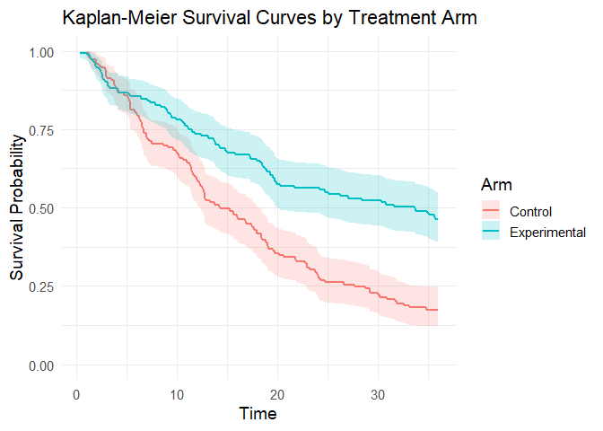<!-- -->

``` r
data(package = "bayescores")
```

### Step 3: Simulate study toxicity

Generate toxicity data for a trial with 1:1 randomization (150 control
patients), baseline toxicity of 50% (any-grade), 20% severe events
(G3–4), and 1.5× higher toxicity in the experimental arm. QoL outcomes
assume “Significant Improvement” with “Very High” evidence.

**Quality of Life Parameters:**

- `qol_scenario` (expected QoL outcome):

- `1`: **Significant Improvement**

- `2`: **Stabilization / Probable Benefit**

- `3`: **No Difference / Marginal Benefit**

- `4`: **Deterioration**

- `5`: **Insufficient Data / Unknown**

- `qol_strength` (confidence in QoL evidence):

- `1`: **Very Low**

- `2`: **Low**

- `3`: **Moderate**

- `4`: **High**

- `5`: **Very High**

``` r
toxicity_trial <- simulate_trial_data(
  n_control = 150,
  ratio_str = "1:1",
  control_g1_4_pct = 50,
  control_g3_4_pct = 20,
  tox_ratio = 1.5,
  qol_scenario = 1,
  qol_strength = 5
)
```

To analyze toxicity in *non-simulated data*, you obviously need to go to
the actual toxicity table, look up the quality-of-life articles
associated with that trial, and manually fill in an object similar to
the one produced by the simulate_trial_data function.

Visualize toxicity with AMIT plots:

**Any-grade toxicity (Grades 1–4)**

``` r
create_amit_plot(
  trial_object = toxicity_trial,
  grade_type = "any_grade",
  main_title = "Example: Any-Grade Toxicity Profile",
  data_element = "toxicity",
  n_element = "N_patients"
)
```

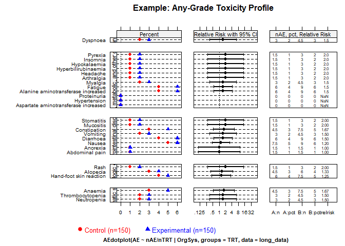<!-- -->

**Severe toxicity (Grades 3+)**

``` r
create_amit_plot(
  trial_object = toxicity_trial,
  grade_type = "severe_grade",
  main_title = "Example: Severe-Grade (G3+) Toxicity Profile",
  data_element = "toxicity",
  n_element = "N_patients"
)
```

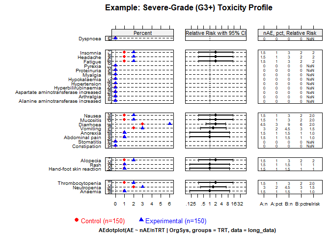<!-- -->

### Step 4: Fit the Bayesian cure model

Fit the Bayesian AFT cure model (use higher `iter` in practice):

``` r
bayesian_fit <- fit_bayesian_cure_model(
  sim_data,
  time_col = "time",
  event_col = "event",
  arm_col = "arm",
  iter = 4000,
  chains = 4
)
```

    ## 
    ## SAMPLING FOR MODEL 'anon_model' NOW (CHAIN 1).
    ## Chain 1: 
    ## Chain 1: Gradient evaluation took 0.000686 seconds
    ## Chain 1: 1000 transitions using 10 leapfrog steps per transition would take 6.86 seconds.
    ## Chain 1: Adjust your expectations accordingly!
    ## Chain 1: 
    ## Chain 1: 
    ## Chain 1: Iteration:    1 / 4000 [  0%]  (Warmup)
    ## Chain 1: Iteration:  400 / 4000 [ 10%]  (Warmup)
    ## Chain 1: Iteration:  800 / 4000 [ 20%]  (Warmup)
    ## Chain 1: Iteration: 1001 / 4000 [ 25%]  (Sampling)
    ## Chain 1: Iteration: 1400 / 4000 [ 35%]  (Sampling)
    ## Chain 1: Iteration: 1800 / 4000 [ 45%]  (Sampling)
    ## Chain 1: Iteration: 2200 / 4000 [ 55%]  (Sampling)
    ## Chain 1: Iteration: 2600 / 4000 [ 65%]  (Sampling)
    ## Chain 1: Iteration: 3000 / 4000 [ 75%]  (Sampling)
    ## Chain 1: Iteration: 3400 / 4000 [ 85%]  (Sampling)
    ## Chain 1: Iteration: 3800 / 4000 [ 95%]  (Sampling)
    ## Chain 1: Iteration: 4000 / 4000 [100%]  (Sampling)
    ## Chain 1: 
    ## Chain 1:  Elapsed Time: 25.179 seconds (Warm-up)
    ## Chain 1:                61.351 seconds (Sampling)
    ## Chain 1:                86.53 seconds (Total)
    ## Chain 1: 
    ## 
    ## SAMPLING FOR MODEL 'anon_model' NOW (CHAIN 2).
    ## Chain 2: 
    ## Chain 2: Gradient evaluation took 0.000312 seconds
    ## Chain 2: 1000 transitions using 10 leapfrog steps per transition would take 3.12 seconds.
    ## Chain 2: Adjust your expectations accordingly!
    ## Chain 2: 
    ## Chain 2: 
    ## Chain 2: Iteration:    1 / 4000 [  0%]  (Warmup)
    ## Chain 2: Iteration:  400 / 4000 [ 10%]  (Warmup)
    ## Chain 2: Iteration:  800 / 4000 [ 20%]  (Warmup)
    ## Chain 2: Iteration: 1001 / 4000 [ 25%]  (Sampling)
    ## Chain 2: Iteration: 1400 / 4000 [ 35%]  (Sampling)
    ## Chain 2: Iteration: 1800 / 4000 [ 45%]  (Sampling)
    ## Chain 2: Iteration: 2200 / 4000 [ 55%]  (Sampling)
    ## Chain 2: Iteration: 2600 / 4000 [ 65%]  (Sampling)
    ## Chain 2: Iteration: 3000 / 4000 [ 75%]  (Sampling)
    ## Chain 2: Iteration: 3400 / 4000 [ 85%]  (Sampling)
    ## Chain 2: Iteration: 3800 / 4000 [ 95%]  (Sampling)
    ## Chain 2: Iteration: 4000 / 4000 [100%]  (Sampling)
    ## Chain 2: 
    ## Chain 2:  Elapsed Time: 22.532 seconds (Warm-up)
    ## Chain 2:                70.608 seconds (Sampling)
    ## Chain 2:                93.14 seconds (Total)
    ## Chain 2: 
    ## 
    ## SAMPLING FOR MODEL 'anon_model' NOW (CHAIN 3).
    ## Chain 3: 
    ## Chain 3: Gradient evaluation took 0.000323 seconds
    ## Chain 3: 1000 transitions using 10 leapfrog steps per transition would take 3.23 seconds.
    ## Chain 3: Adjust your expectations accordingly!
    ## Chain 3: 
    ## Chain 3: 
    ## Chain 3: Iteration:    1 / 4000 [  0%]  (Warmup)
    ## Chain 3: Iteration:  400 / 4000 [ 10%]  (Warmup)
    ## Chain 3: Iteration:  800 / 4000 [ 20%]  (Warmup)
    ## Chain 3: Iteration: 1001 / 4000 [ 25%]  (Sampling)
    ## Chain 3: Iteration: 1400 / 4000 [ 35%]  (Sampling)
    ## Chain 3: Iteration: 1800 / 4000 [ 45%]  (Sampling)
    ## Chain 3: Iteration: 2200 / 4000 [ 55%]  (Sampling)
    ## Chain 3: Iteration: 2600 / 4000 [ 65%]  (Sampling)
    ## Chain 3: Iteration: 3000 / 4000 [ 75%]  (Sampling)
    ## Chain 3: Iteration: 3400 / 4000 [ 85%]  (Sampling)
    ## Chain 3: Iteration: 3800 / 4000 [ 95%]  (Sampling)
    ## Chain 3: Iteration: 4000 / 4000 [100%]  (Sampling)
    ## Chain 3: 
    ## Chain 3:  Elapsed Time: 22.18 seconds (Warm-up)
    ## Chain 3:                64.98 seconds (Sampling)
    ## Chain 3:                87.16 seconds (Total)
    ## Chain 3: 
    ## 
    ## SAMPLING FOR MODEL 'anon_model' NOW (CHAIN 4).
    ## Chain 4: 
    ## Chain 4: Gradient evaluation took 0.000498 seconds
    ## Chain 4: 1000 transitions using 10 leapfrog steps per transition would take 4.98 seconds.
    ## Chain 4: Adjust your expectations accordingly!
    ## Chain 4: 
    ## Chain 4: 
    ## Chain 4: Iteration:    1 / 4000 [  0%]  (Warmup)
    ## Chain 4: Iteration:  400 / 4000 [ 10%]  (Warmup)
    ## Chain 4: Iteration:  800 / 4000 [ 20%]  (Warmup)
    ## Chain 4: Iteration: 1001 / 4000 [ 25%]  (Sampling)
    ## Chain 4: Iteration: 1400 / 4000 [ 35%]  (Sampling)
    ## Chain 4: Iteration: 1800 / 4000 [ 45%]  (Sampling)
    ## Chain 4: Iteration: 2200 / 4000 [ 55%]  (Sampling)
    ## Chain 4: Iteration: 2600 / 4000 [ 65%]  (Sampling)
    ## Chain 4: Iteration: 3000 / 4000 [ 75%]  (Sampling)
    ## Chain 4: Iteration: 3400 / 4000 [ 85%]  (Sampling)
    ## Chain 4: Iteration: 3800 / 4000 [ 95%]  (Sampling)
    ## Chain 4: Iteration: 4000 / 4000 [100%]  (Sampling)
    ## Chain 4: 
    ## Chain 4:  Elapsed Time: 21.162 seconds (Warm-up)
    ## Chain 4:                64.526 seconds (Sampling)
    ## Chain 4:                85.688 seconds (Total)
    ## Chain 4:

### Step 5: Analyze and visualize model results

The mixture cure model separates individuals into:

- **Cured (long-term survivors)**: negligible event risk long-term.
- **Susceptible (uncured)**: ongoing event risk; survival prolonged but
  not cured.

Inspect numerical summaries and visualize posterior distributions. You
can verify that the model satisfactorily recovers the time ratio and the
fractions of long‑term survivors. However, the model also signals an
identifiability issue (see below).

``` r
print(bayesian_fit$stan_fit, pars = c("beta_cure_arm", "beta_surv_arm", "alpha"))
```

    ## Inference for Stan model: anon_model.
    ## 4 chains, each with iter=4000; warmup=1000; thin=1; 
    ## post-warmup draws per chain=3000, total post-warmup draws=12000.
    ## 
    ##               mean se_mean   sd  2.5%  25%  50%  75% 97.5% n_eff Rhat
    ## beta_cure_arm 1.48    0.04 1.45 -2.77 1.16 1.64 2.15  3.83  1716    1
    ## beta_surv_arm 0.27    0.01 0.29 -0.19 0.06 0.22 0.45  0.92  1573    1
    ## alpha         1.21    0.00 0.10  1.02 1.14 1.21 1.28  1.42  1928    1
    ## 
    ## Samples were drawn using NUTS(diag_e) at Sun Oct  5 18:01:09 2025.
    ## For each parameter, n_eff is a crude measure of effective sample size,
    ## and Rhat is the potential scale reduction factor on split chains (at 
    ## convergence, Rhat=1).

``` r
outcomes(bayesian_fit)
```

    ## 
    ## ---
    ## Posterior correlation as an identifiability check:
    ##    Correlation: -0.632
    ##    Interpretation: Strong (-0.50 to -0.70): high ambiguity, marginal estimates fragile.
    ## ---

    ## # A tibble: 5 × 2
    ##   Metric                                     `Result (95% CI)`    
    ##   <chr>                                      <chr>                
    ## 1 Time Ratio (TR)                            1.25 (0.83 - 2.50)   
    ## 2 Odds Ratio (OR) for Cure                   5.13 (0.06 - 46.22)  
    ## 3 Long-Term Survival Rate (%) - Control      8.29 (0.18 - 17.89)  
    ## 4 Long-Term Survival Rate (%) - Experimental 34.63 (0.05 - 47.79) 
    ## 5 Absolute Difference in Survival Rate (%)   24.96 (-5.16 - 40.24)

**MCMC diagnostic plots**

Check the MCMC diagnostic plots to ensure convergence, i.e., to verify
that the Markov chains have mixed well, reached stationarity, and that
parameter estimates are stable and reliable. In addition, examine Rhat
values (should be close to 1) and effective sample sizes (should be
sufficiently large) to confirm robust inference.

``` r
diagnose_fit(bayesian_fit$stan_fit)
```

    ##                         n_eff     Rhat   Rhat_interpretation
    ## beta_cure_intercept  844.4465 1.004639 Excellent convergence
    ## beta_surv_intercept 2570.9448 1.000690 Excellent convergence
    ## beta_cure_arm_raw   1715.6583 1.002294 Excellent convergence
    ## beta_surv_arm_raw   1573.1844 1.001847 Excellent convergence
    ## alpha               1928.3906 1.002243 Excellent convergence
    ## beta_cure_arm       1715.6583 1.002294 Excellent convergence
    ## beta_surv_arm       1573.1844 1.001847 Excellent convergence
    ## lp__                1080.8386 1.002908 Excellent convergence
    ##                           n_eff_interpretation    recommendation
    ## beta_cure_intercept       Moderate, acceptable No action needed.
    ## beta_surv_intercept High effective sample size No action needed.
    ## beta_cure_arm_raw   High effective sample size No action needed.
    ## beta_surv_arm_raw   High effective sample size No action needed.
    ## alpha               High effective sample size No action needed.
    ## beta_cure_arm       High effective sample size No action needed.
    ## beta_surv_arm       High effective sample size No action needed.
    ## lp__                High effective sample size No action needed.

``` r
model_diagnostics(bayesian_fit)
```

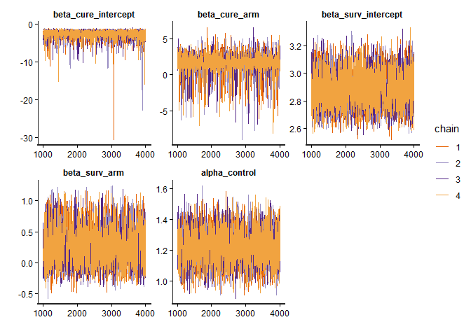<!-- -->

**Posterior distributions**

``` r
plot_densities(bayesian_fit)
```

<figure>
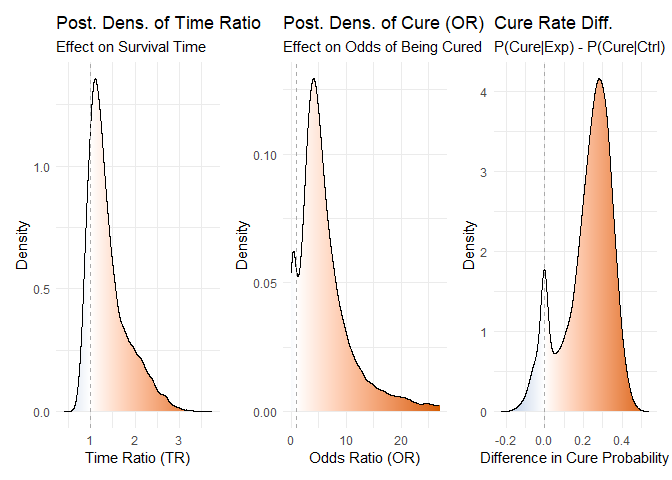
<figcaption aria-hidden="true">Figure 1: Posterior density distributions
for Time Ratio, Odds Ratio of Cure, and Cure Probability
Difference.</figcaption>
</figure>

**Joint posterior densities** The mixture cure model jointly estimates
the TR and OR parameters, yielding a joint posterior distribution of
plausible values for both. This joint estimation is essential to avoid
the bias that would arise if the parameters were fitted separately. In
this example, however, we simulated a challenging scenario where the two
parameters are difficult to disentangle due to limited follow-up. The
model reflects this difficulty through a strong negative correlation
between the estimates (Pearson correlation –0.615), which illustrates
the lack of identifiability: the model struggles to assign effects
correctly given the data limitations. This dependence is clearly visible
in the figure.

``` r
plot_correlated_densities(bayesian_fit)
```

<figure>
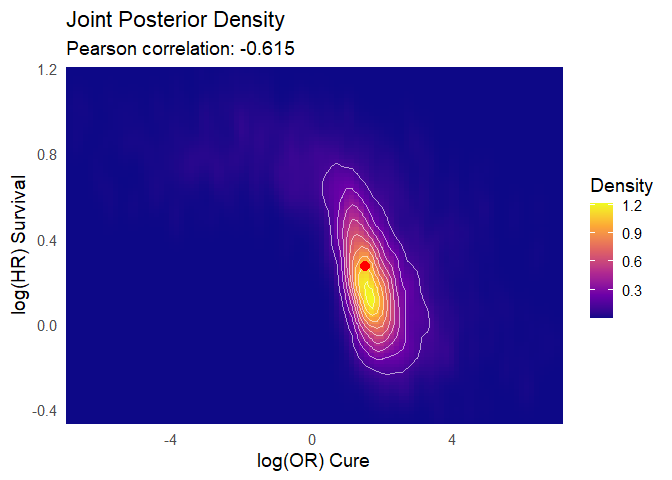
<figcaption aria-hidden="true">Figure 2: Joint posterior density
distributions for Time Ratio &amp; Odds Ratio of Cure</figcaption>
</figure>

**Posterior predictive check** You can observe how the model’s
predictions align satisfactorily with the Kaplan–Meier estimator:

``` r
plot(bayesian_fit)
```

<figure>
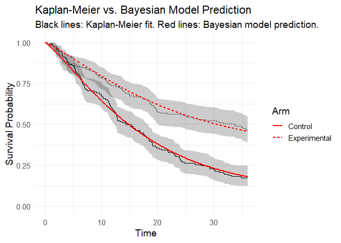
<figcaption aria-hidden="true">Figure 3: Posterior predictive check
(model vs Kaplan-Meier data).</figcaption>
</figure>

### Step 6: Integrate toxicity data

Toxicity is summarized by a burden‑of‑toxicity score, which weights both
the severity and the category of toxicity (see technical documentation).

``` r
set.seed(123)

soc_weights <- c(
  "Gastrointestinal disorders" = 1.2,
  "Blood and lymphatic system disorders" = 1.6,
  "General, metabolic, and other disorders" = 1.3,
  "Dermatologic disorders" = 1.1,
  "Infections and infestations" = 1.6,
  "Respiratory, thoracic and mediastinal disorders" = 2.5)

toxicity_output <- calculate_toxicity_analysis(
  trial_data = toxicity_trial,
  n_simulations = bayesian_fit$n_draws,
  unacceptable_rel_increase = 0.5,
  k_uncertainty = 5,
  soc_weights = soc_weights
)
```

***Note on customizing toxicity weights***

The default weights for toxicity categories (e.g., “Gastrointestinal
disorders” = 1.2, “Respiratory, thoracic and mediastinal disorders” =
2.5) are a sensible starting point, but they are not one-size-fits-all.
The clinical impact of a side effect is highly context-dependent. For
example, severe nausea might be considered more burdensome in a
palliative setting than in a curative one.

We strongly encourage stakeholders—clinicians, patient representatives,
and regulators—to discuss and customize these weights to reflect the
specific disease context and patient population of the trial being
evaluated. The `calculate_toxicity_analysis` function is designed for
this flexibility via the `soc_weights` argument, allowing for a more
nuanced and clinically relevant analysis.

# Understanding the Toxicity Analysis in Practice

The toxicity analysis provides a nuanced view of a drug’s safety
profile. Let’s break down the key parameters using a practical example
where the function returns these scores:

    > toxicity_output$wts_scores
      Experimental Control
    1       3.147  2.007

**1. What are the WTS (Weighted Toxicity Scores)?**

Think of the WTS as a *total harm score* for each arm of the trial. It’s
not just a simple count of side effects. Instead, it’s a composite score
where:

- *Severity matters*: High-grade toxicities (Grade 3-4) add much more to
  the score than low-grade ones.
- *Type matters*: Clinically relevant toxicities (e.g., blood disorders)
  are weighted more heavily than less critical ones (e.g., skin
  disorders).

Let’s say the experimental arm ended up with a harm score of 3.147,
versus 2.007 for control. (Truth be told, these numbers dance around a
little — it’s a simulation — but you get the idea.) What matters is the
pattern: the experimental drug is clearly more toxic. The real question
is: how much more is too much?

------------------------------------------------------------------------

**2. Defining “Unacceptable” (`unacceptable_rel_increase = 0.5`)**

This parameter is your *toxicity budget*. It doesn’t set a fixed limit,
but a relative one based on the control arm.  
A value of `0.5` means:

> “I am willing to accept a new drug that is up to 50% more toxic than
> the control. Anything beyond that, I consider unacceptable.”

Let’s apply this to our scores:

- **Your Budget** (in WTS points): `0.5*  2.007 = 1.0035`
- **The Observed Cost**: `3.147 - 1.0035 = 2.1435`

**Conclusion**: The observed increase in harm (**2.1435**) is greater
than your budget (**1.0035**).  
Therefore, according to your own definition, the toxicity of the new
drug is *unacceptable*.

This comparison is used to center the final probability distribution.

------------------------------------------------------------------------

**3. Calibrating Uncertainty (`k_uncertainty`)**

The real world has uncertainty. The `k_uncertainty` parameter lets you
define how skeptical you are of the results, which influences the
*confidence* of the final output. It directly controls the width of the
final probability distribution.

- A low `k` (e.g., 5) means you have high confidence in the data. You
  believe the observed difference is close to the true difference. This
  results in a narrow, sharp probability distribution, leading to a more
  decisive conclusion.
- A high `k` (e.g., 30) means you are more skeptical. You believe the
  observed difference could be due to random chance, especially with a
  small number of patients. This results in a wide, flat probability
  distribution, indicating less certainty in the outcome.

In short, `k_uncertainty` allows you to calibrate the model based on the
quality and size of the trial data, ensuring the final result reflects
an appropriate level of statistical confidence.

### Step 7: Quality-of-life weighting

QoL adjustments modeled using multinomial distribution:

``` r
qol_scores <- sample_qol_scores(
  prob_vector = toxicity_trial$qol,
  n_samples = bayesian_fit$n_draws
)

plot_qol_histogram(qol_scores)
```

<figure>
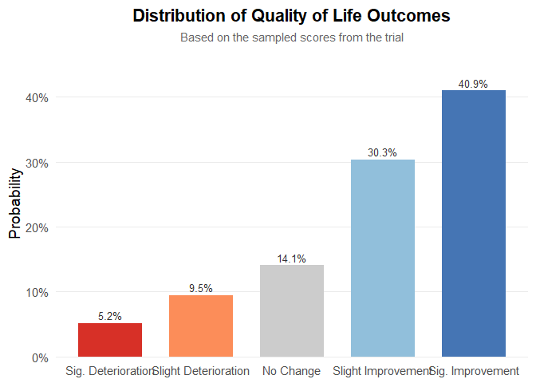
<figcaption aria-hidden="true">Figure 5: Multinomial distribution of QoL
levels.</figcaption>
</figure>

We have chosen this methodology because quality‑of‑life data are
published very inconsistently—indeed, the data are a mess—and the
approach will likely evolve over time. Therefore, you must read the
paper, qualitatively interpret the results, and assess both the impact
on quality of life and the strength of evidence. The outcome will be a
multinomial distribution, as shown below. It is quite straightforward:
to work with real data, the package includes the function
generate_qol_vector(), which interactively generates a quality‑of‑life
(QoL) probability vector.

### Step 8: Extract posterior samples and compute BayeScores

# From Clinical Data to a Final Score

Okay, we have the results from our Bayesian model, but how do we turn
these numbers into a single, intuitive **BayeScore**?

This is where the *calibration* comes in.

------------------------------------------------------------------------

Instead of using fixed rules, our model translates each clinical outcome
into a  
**utility score** (from 0 to 100) using a flexible exponential utility
function.

Think of it this way:  
the *first* improvements are the most exciting.  
Going from no benefit to *some* benefit is a huge leap.  
Further gains are still good, but the “wow factor” diminishes slightly.

Our function captures this key principle of **diminishing marginal
utility**.

------------------------------------------------------------------------

The best part is: *you define the value judgment*.  
The shape of these utility curves is determined by setting simple
**anchor points**.  
You answer the question:

> “How much is a certain clinical benefit worth on a 0–100 scale?”

For example, in our analysis, we used the following calibration:

``` r
outcomes_obj <- outcomes(
  fit = bayesian_fit,
  shrinkage_method = "none"
)
```

    ## 
    ## ---
    ## Posterior correlation as an identifiability check:
    ##    Correlation: -0.632
    ##    Interpretation: Strong (-0.50 to -0.70): high ambiguity, marginal estimates fragile.
    ## ---

``` r
efficacy_draws <- get_bayescores_draws(
  fit = bayesian_fit,
  shrinkage_method = "none"
)


# 1. Define the Final Calibration Settings ---
my_final_calibration <- list(
  efficacy = list(
    # Aggressive curve for Cure
    cure_utility_target = list(effect_value = 0.20, utility_value = 75),
    
    # Slower curve for TR
    tr_utility_target = list(effect_value = 1.25, utility_value = 50)
  )
)


# 2. Run the Bayescores Function on Your Data ---
# The function takes your data objects directly as inputs.

final_scores <- get_bayescores(
  efficacy_inputs = efficacy_draws,
  qol_scores = qol_scores,
  toxicity_scores = toxicity_output$toxicity_effect_vector,
  calibration_args = my_final_calibration
)
cat("--- Final Bayescores Summary ---\n")
```

    ## --- Final Bayescores Summary ---

``` r
print(final_scores$component_summary)
```

    ##                        Component    Median Lower_95_CrI.2.5% Upper_95_CrI.97.5%
    ## 1           Utility Cure (0-100) 82.276340           0.00000        93.85181666
    ## 2          Utility TR (for TR>1) 49.964971           0.00000        98.42832901
    ## 3          Penalty TR (for TR<1)  0.000000         -25.94557         0.00000000
    ## 4      Efficacy Score (Combined) 91.572089          65.79173        98.66816331
    ## 5      QoL Contribution (points)  3.874195         -10.06459        19.83037965
    ## 6 Toxicity Contribution (points) -3.216395         -22.44158        -0.04681272
    ## 7            FINAL UTILITY SCORE 92.978166          46.68577        99.90054453

``` r
print(final_scores$identifiability_level)
```

    ## [1] "Extreme"

### Step 9: Visualize final clinical benefit

**BayeScore donut plot**

After these analyses, the tool delivers a final clinical utility score
derived from all the weightings, representing the drug’s overall
evaluation. This score is based on a simulation that assumed therapeutic
benefit while also incorporating some toxicity, yet still resulted in an
improvement in quality of life.

Notably, the model captures a substantial benefit driven by the large
long-term survival effect. However, it also indicates a clear
identifiability problem: there is simply not enough evidence yet to
disentangle these parameters.

``` r
plot_utility_donut(final_scores, trial_name ="Simulated dataset (unshrinkaged)")
```

<figure>
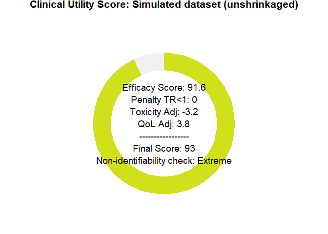
<figcaption aria-hidden="true">Figure 6: BayeScore donut
plot.</figcaption>
</figure>

**Final score posterior distribution**

It’s clear that estimating clinical benefit carries substantial
uncertainty—studies are noisy, and sample sizes are limited. We’ve
rigorously propagated every source of uncertainty throughout the
analysis, so that you alone judge the credibility of the results.

That is the power of the BayeScore: it isn’t a single point estimate but
a full Bayesian distribution!

``` r
plot_final_utility_density(final_scores)
```

<figure>
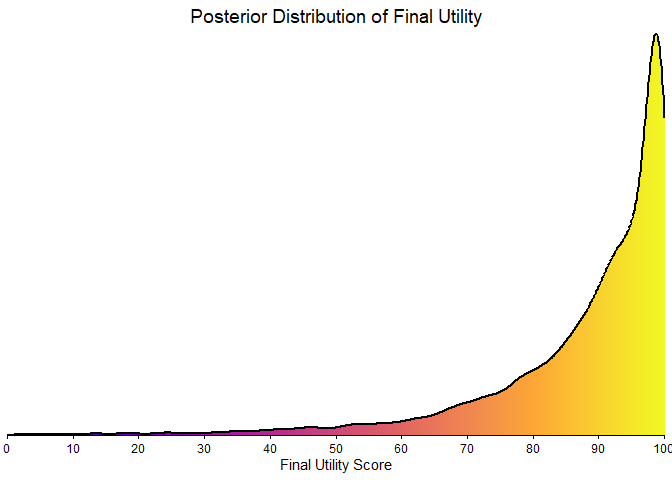
<figcaption aria-hidden="true">Figure 7: Final BayeScore posterior
distribution.</figcaption>
</figure>

***Note on model overestimation and a proposed solution***

Okay, so looking at the unadjusted scores, you might be thinking:

> “Hold on… a high score for a study with 300 subjects, based on
> long-term survival but with such short follow-up, seems a bit
> exaggerated—even assuming better QoL. What’s going on here?”

And that’s a great question. You should be aware of an inherent
challenge in many statistical models—including mixture cure models—when
applied to clinical trials with smaller sample sizes (low n). In this
example, n = 300 is reasonable, but the short follow-up makes it
difficult to accurately model the plateau of the survival curve, as
shown in the Kaplan–Meier plot. Such limitations can have a significant
impact on the estimation of bayescores.

# Empirical bayesian shrinkage

To address this, we can apply an empirical shrinkage correction. This
method leverages data from thousands of previous clinical trials to
create a more realistic prior expectation of treatment effects, pulling
our potentially exaggerated results toward a more plausible value. The
prior is applied to the dominant endpoint—in this case, long-term
survival. Applying the Zwet prior is appropriate as a Bayesian
regularization mechanism to contain bias under conditions of limited
information. This approach controls model instability; it does not
magically resolve the underlying identifiability problem, which can only
be overcome with longer follow-up. This package implements two such
data-driven priors:

- **“zwet”**: a general prior based on 23 551 trials from all fields of
  medicine.

  van Zwet E, Schwab S, Senn S. (2021). *The statistical properties of
  RCTs and a proposal for shrinkage*. Statistics in Medicine. DOI:
  10.1002/sim.9173.

- **“sherry”**: a more specific prior based on 415 phase III oncology
  trials, so an option for cancer-related studies.

  Sherry AD, Msaouel P, et al. (2024). *An Evidence-Based Prior for
  Estimating the Treatment Effect of Phase III Randomized Trials in
  Oncology*. JCO Precision Oncology. DOI: 10.1200/PO.24.00363.

Let’s see how applying these corrections affects our final utility
score.

``` r
# apply shrinkage with zwet prior
efficacy_draws_zwet <- get_bayescores_draws(
  fit = bayesian_fit,
  shrinkage_method = "zwet",
  shrinkage_target = "primary"
)

final_scores_zwet <- get_bayescores(
  efficacy_inputs = efficacy_draws_zwet, 
  qol_scores = qol_scores,
  toxicity_scores = toxicity_output$toxicity_effect_vector,
  calibration_args = my_final_calibration
)

# apply shrinkage with zwet prior
efficacy_draws_sherry <- get_bayescores_draws(
  fit = bayesian_fit,
  shrinkage_method = "sherry",
  shrinkage_target = "primary"
)

final_scores_sherry <- get_bayescores(
  efficacy_inputs = efficacy_draws_sherry, 
  qol_scores = qol_scores,
  toxicity_scores = toxicity_output$toxicity_effect_vector,
  calibration_args = my_final_calibration
)

# compare unshrunk vs. zwet vs. sherry
comparison <- rbind(
  cbind(prior = "unshrunk", final_scores$component_summary[7,2 , drop = FALSE]),
  cbind(prior = "zwet",     final_scores_zwet$component_summary[7,2 , drop = FALSE]),
  cbind(prior = "sherry",   final_scores_sherry$component_summary[7,2 , drop = FALSE])
)

print(comparison)
```

    ##       prior   Median
    ## 7  unshrunk 92.97817
    ## 71     zwet 79.03599
    ## 72   sherry 88.08349

``` r
# plot utility donuts for each prior
plot_utility_donut(final_scores_zwet, trial_name ="Zwet's shrinkage")
```

<!-- -->

``` r
plot_utility_donut(final_scores_sherry, trial_name ="sherry's shrinkage")
```

<!-- -->

You can see how each empirical prior pulls the original estimates toward
more conservative, data-driven values. This shrinkage step provides a
robust sensitivity analysis, helping to understand how potential
overestimation might impact the overall utility of a treatment and
leading to more reliable conclusions for decision-making.

***Extended follow-up***

To simulate a mature data release, we repeat the trial simulation with
an extended follow-up. In this scenario, the long-term survivors are
fully segregated from the rest of the patient population, which resolves
the non-identifiability issue.

You can clearly see how the model captures this more complete
statistical evidence and acts accordingly. This demonstrates the
method’s capacity to adapt to the amount of information available in a
study, providing a more confident and precise measure of the long-term
benefit once the data is mature.

``` r
set.seed(123)

# 1) Simulate with extended follow-up
set.seed(123)

sim_data <- simulate_weibull_cure_data(
  n_patients = 300,
  cure_fraction_ctrl = 0.15,
  cure_fraction_exp = 0.40,
  max_follow_up = 5*12,
  weibull_shape = 1.2,
  median_survival_ctrl = 12,
  time_ratio_exp = 1.25
)

# 2) Fit Bayesian mixture cure model
bayesian_fit <- fit_bayesian_cure_model(
  sim_data,
  time_col  = "time",
  event_col = "event",
  arm_col   = "arm",
  iter      = 2500,
  chains    = 4
)
```

    ## 
    ## SAMPLING FOR MODEL 'anon_model' NOW (CHAIN 1).
    ## Chain 1: 
    ## Chain 1: Gradient evaluation took 0.000567 seconds
    ## Chain 1: 1000 transitions using 10 leapfrog steps per transition would take 5.67 seconds.
    ## Chain 1: Adjust your expectations accordingly!
    ## Chain 1: 
    ## Chain 1: 
    ## Chain 1: Iteration:    1 / 2500 [  0%]  (Warmup)
    ## Chain 1: Iteration:  250 / 2500 [ 10%]  (Warmup)
    ## Chain 1: Iteration:  500 / 2500 [ 20%]  (Warmup)
    ## Chain 1: Iteration:  750 / 2500 [ 30%]  (Warmup)
    ## Chain 1: Iteration: 1000 / 2500 [ 40%]  (Warmup)
    ## Chain 1: Iteration: 1001 / 2500 [ 40%]  (Sampling)
    ## Chain 1: Iteration: 1250 / 2500 [ 50%]  (Sampling)
    ## Chain 1: Iteration: 1500 / 2500 [ 60%]  (Sampling)
    ## Chain 1: Iteration: 1750 / 2500 [ 70%]  (Sampling)
    ## Chain 1: Iteration: 2000 / 2500 [ 80%]  (Sampling)
    ## Chain 1: Iteration: 2250 / 2500 [ 90%]  (Sampling)
    ## Chain 1: Iteration: 2500 / 2500 [100%]  (Sampling)
    ## Chain 1: 
    ## Chain 1:  Elapsed Time: 10.266 seconds (Warm-up)
    ## Chain 1:                11.005 seconds (Sampling)
    ## Chain 1:                21.271 seconds (Total)
    ## Chain 1: 
    ## 
    ## SAMPLING FOR MODEL 'anon_model' NOW (CHAIN 2).
    ## Chain 2: 
    ## Chain 2: Gradient evaluation took 0.000279 seconds
    ## Chain 2: 1000 transitions using 10 leapfrog steps per transition would take 2.79 seconds.
    ## Chain 2: Adjust your expectations accordingly!
    ## Chain 2: 
    ## Chain 2: 
    ## Chain 2: Iteration:    1 / 2500 [  0%]  (Warmup)
    ## Chain 2: Iteration:  250 / 2500 [ 10%]  (Warmup)
    ## Chain 2: Iteration:  500 / 2500 [ 20%]  (Warmup)
    ## Chain 2: Iteration:  750 / 2500 [ 30%]  (Warmup)
    ## Chain 2: Iteration: 1000 / 2500 [ 40%]  (Warmup)
    ## Chain 2: Iteration: 1001 / 2500 [ 40%]  (Sampling)
    ## Chain 2: Iteration: 1250 / 2500 [ 50%]  (Sampling)
    ## Chain 2: Iteration: 1500 / 2500 [ 60%]  (Sampling)
    ## Chain 2: Iteration: 1750 / 2500 [ 70%]  (Sampling)
    ## Chain 2: Iteration: 2000 / 2500 [ 80%]  (Sampling)
    ## Chain 2: Iteration: 2250 / 2500 [ 90%]  (Sampling)
    ## Chain 2: Iteration: 2500 / 2500 [100%]  (Sampling)
    ## Chain 2: 
    ## Chain 2:  Elapsed Time: 9.618 seconds (Warm-up)
    ## Chain 2:                14.35 seconds (Sampling)
    ## Chain 2:                23.968 seconds (Total)
    ## Chain 2: 
    ## 
    ## SAMPLING FOR MODEL 'anon_model' NOW (CHAIN 3).
    ## Chain 3: 
    ## Chain 3: Gradient evaluation took 0.000247 seconds
    ## Chain 3: 1000 transitions using 10 leapfrog steps per transition would take 2.47 seconds.
    ## Chain 3: Adjust your expectations accordingly!
    ## Chain 3: 
    ## Chain 3: 
    ## Chain 3: Iteration:    1 / 2500 [  0%]  (Warmup)
    ## Chain 3: Iteration:  250 / 2500 [ 10%]  (Warmup)
    ## Chain 3: Iteration:  500 / 2500 [ 20%]  (Warmup)
    ## Chain 3: Iteration:  750 / 2500 [ 30%]  (Warmup)
    ## Chain 3: Iteration: 1000 / 2500 [ 40%]  (Warmup)
    ## Chain 3: Iteration: 1001 / 2500 [ 40%]  (Sampling)
    ## Chain 3: Iteration: 1250 / 2500 [ 50%]  (Sampling)
    ## Chain 3: Iteration: 1500 / 2500 [ 60%]  (Sampling)
    ## Chain 3: Iteration: 1750 / 2500 [ 70%]  (Sampling)
    ## Chain 3: Iteration: 2000 / 2500 [ 80%]  (Sampling)
    ## Chain 3: Iteration: 2250 / 2500 [ 90%]  (Sampling)
    ## Chain 3: Iteration: 2500 / 2500 [100%]  (Sampling)
    ## Chain 3: 
    ## Chain 3:  Elapsed Time: 10.417 seconds (Warm-up)
    ## Chain 3:                16.461 seconds (Sampling)
    ## Chain 3:                26.878 seconds (Total)
    ## Chain 3: 
    ## 
    ## SAMPLING FOR MODEL 'anon_model' NOW (CHAIN 4).
    ## Chain 4: 
    ## Chain 4: Gradient evaluation took 0.000262 seconds
    ## Chain 4: 1000 transitions using 10 leapfrog steps per transition would take 2.62 seconds.
    ## Chain 4: Adjust your expectations accordingly!
    ## Chain 4: 
    ## Chain 4: 
    ## Chain 4: Iteration:    1 / 2500 [  0%]  (Warmup)
    ## Chain 4: Iteration:  250 / 2500 [ 10%]  (Warmup)
    ## Chain 4: Iteration:  500 / 2500 [ 20%]  (Warmup)
    ## Chain 4: Iteration:  750 / 2500 [ 30%]  (Warmup)
    ## Chain 4: Iteration: 1000 / 2500 [ 40%]  (Warmup)
    ## Chain 4: Iteration: 1001 / 2500 [ 40%]  (Sampling)
    ## Chain 4: Iteration: 1250 / 2500 [ 50%]  (Sampling)
    ## Chain 4: Iteration: 1500 / 2500 [ 60%]  (Sampling)
    ## Chain 4: Iteration: 1750 / 2500 [ 70%]  (Sampling)
    ## Chain 4: Iteration: 2000 / 2500 [ 80%]  (Sampling)
    ## Chain 4: Iteration: 2250 / 2500 [ 90%]  (Sampling)
    ## Chain 4: Iteration: 2500 / 2500 [100%]  (Sampling)
    ## Chain 4: 
    ## Chain 4:  Elapsed Time: 9.463 seconds (Warm-up)
    ## Chain 4:                15.028 seconds (Sampling)
    ## Chain 4:                24.491 seconds (Total)
    ## Chain 4:

``` r
plot_correlated_densities(bayesian_fit)
```

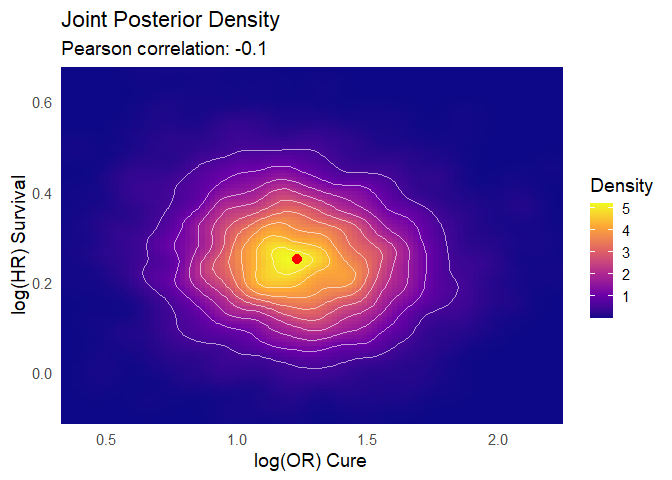<!-- -->

***A Framework for Complex Clinical and Ethical Trade-offs***

The power of Bayesian AFT mixture cure models lies in their unique
ability to evaluate the complex ethical and clinical trade-offs across
the entire spectrum of cancer treatment, from curative-intent trials to
metastatic disease. Their strength is in decomposing a therapy’s
effects, avoiding the misleading single averages that hide critical
realities.

In curative-intent trials, for instance, the model is uniquely suited to
answer two fundamental questions simultaneously: Does the therapy
increase the number of cured patients? And for the group of patients who
are not cured, what is the effect on their time to relapse or
progression? This nuanced approach is also critical in metastatic
settings, particularly with immunotherapy, where the model evaluates the
trade-off between durable, long-term survival for a minority versus the
outcome for the refractory majority.

By transparently quantifying each of these distinct effects—the change
in the cure rate, the outcome for those not cured, and the chance for
long-term survival—these models provide the multi-dimensional evidence
essential for assessing the true clinical benefit of modern cancer
therapies.

``` r
set.seed(123)

# 1) Simulate an archetypal mixed cohort
sim_data <- simulate_weibull_cure_data(
  n_patients          = 300,
  cure_fraction_ctrl  = 0.20,
  cure_fraction_exp   = 0.35,
  max_follow_up       = 60,
  weibull_shape       = 1.2,
  median_survival_ctrl= 12,
  time_ratio_exp      = 0.75
)

# 2) Fit Bayesian mixture cure model
bayesian_fit <- fit_bayesian_cure_model(
  sim_data,
  time_col  = "time",
  event_col = "event",
  arm_col   = "arm",
  iter      = 2500,
  chains    = 4
)
```

    ## 
    ## SAMPLING FOR MODEL 'anon_model' NOW (CHAIN 1).
    ## Chain 1: 
    ## Chain 1: Gradient evaluation took 0.000309 seconds
    ## Chain 1: 1000 transitions using 10 leapfrog steps per transition would take 3.09 seconds.
    ## Chain 1: Adjust your expectations accordingly!
    ## Chain 1: 
    ## Chain 1: 
    ## Chain 1: Iteration:    1 / 2500 [  0%]  (Warmup)
    ## Chain 1: Iteration:  250 / 2500 [ 10%]  (Warmup)
    ## Chain 1: Iteration:  500 / 2500 [ 20%]  (Warmup)
    ## Chain 1: Iteration:  750 / 2500 [ 30%]  (Warmup)
    ## Chain 1: Iteration: 1000 / 2500 [ 40%]  (Warmup)
    ## Chain 1: Iteration: 1001 / 2500 [ 40%]  (Sampling)
    ## Chain 1: Iteration: 1250 / 2500 [ 50%]  (Sampling)
    ## Chain 1: Iteration: 1500 / 2500 [ 60%]  (Sampling)
    ## Chain 1: Iteration: 1750 / 2500 [ 70%]  (Sampling)
    ## Chain 1: Iteration: 2000 / 2500 [ 80%]  (Sampling)
    ## Chain 1: Iteration: 2250 / 2500 [ 90%]  (Sampling)
    ## Chain 1: Iteration: 2500 / 2500 [100%]  (Sampling)
    ## Chain 1: 
    ## Chain 1:  Elapsed Time: 12.224 seconds (Warm-up)
    ## Chain 1:                15.118 seconds (Sampling)
    ## Chain 1:                27.342 seconds (Total)
    ## Chain 1: 
    ## 
    ## SAMPLING FOR MODEL 'anon_model' NOW (CHAIN 2).
    ## Chain 2: 
    ## Chain 2: Gradient evaluation took 0.000235 seconds
    ## Chain 2: 1000 transitions using 10 leapfrog steps per transition would take 2.35 seconds.
    ## Chain 2: Adjust your expectations accordingly!
    ## Chain 2: 
    ## Chain 2: 
    ## Chain 2: Iteration:    1 / 2500 [  0%]  (Warmup)
    ## Chain 2: Iteration:  250 / 2500 [ 10%]  (Warmup)
    ## Chain 2: Iteration:  500 / 2500 [ 20%]  (Warmup)
    ## Chain 2: Iteration:  750 / 2500 [ 30%]  (Warmup)
    ## Chain 2: Iteration: 1000 / 2500 [ 40%]  (Warmup)
    ## Chain 2: Iteration: 1001 / 2500 [ 40%]  (Sampling)
    ## Chain 2: Iteration: 1250 / 2500 [ 50%]  (Sampling)
    ## Chain 2: Iteration: 1500 / 2500 [ 60%]  (Sampling)
    ## Chain 2: Iteration: 1750 / 2500 [ 70%]  (Sampling)
    ## Chain 2: Iteration: 2000 / 2500 [ 80%]  (Sampling)
    ## Chain 2: Iteration: 2250 / 2500 [ 90%]  (Sampling)
    ## Chain 2: Iteration: 2500 / 2500 [100%]  (Sampling)
    ## Chain 2: 
    ## Chain 2:  Elapsed Time: 9.866 seconds (Warm-up)
    ## Chain 2:                14.278 seconds (Sampling)
    ## Chain 2:                24.144 seconds (Total)
    ## Chain 2: 
    ## 
    ## SAMPLING FOR MODEL 'anon_model' NOW (CHAIN 3).
    ## Chain 3: 
    ## Chain 3: Gradient evaluation took 0.000123 seconds
    ## Chain 3: 1000 transitions using 10 leapfrog steps per transition would take 1.23 seconds.
    ## Chain 3: Adjust your expectations accordingly!
    ## Chain 3: 
    ## Chain 3: 
    ## Chain 3: Iteration:    1 / 2500 [  0%]  (Warmup)
    ## Chain 3: Iteration:  250 / 2500 [ 10%]  (Warmup)
    ## Chain 3: Iteration:  500 / 2500 [ 20%]  (Warmup)
    ## Chain 3: Iteration:  750 / 2500 [ 30%]  (Warmup)
    ## Chain 3: Iteration: 1000 / 2500 [ 40%]  (Warmup)
    ## Chain 3: Iteration: 1001 / 2500 [ 40%]  (Sampling)
    ## Chain 3: Iteration: 1250 / 2500 [ 50%]  (Sampling)
    ## Chain 3: Iteration: 1500 / 2500 [ 60%]  (Sampling)
    ## Chain 3: Iteration: 1750 / 2500 [ 70%]  (Sampling)
    ## Chain 3: Iteration: 2000 / 2500 [ 80%]  (Sampling)
    ## Chain 3: Iteration: 2250 / 2500 [ 90%]  (Sampling)
    ## Chain 3: Iteration: 2500 / 2500 [100%]  (Sampling)
    ## Chain 3: 
    ## Chain 3:  Elapsed Time: 12.261 seconds (Warm-up)
    ## Chain 3:                16.922 seconds (Sampling)
    ## Chain 3:                29.183 seconds (Total)
    ## Chain 3: 
    ## 
    ## SAMPLING FOR MODEL 'anon_model' NOW (CHAIN 4).
    ## Chain 4: 
    ## Chain 4: Gradient evaluation took 0.000567 seconds
    ## Chain 4: 1000 transitions using 10 leapfrog steps per transition would take 5.67 seconds.
    ## Chain 4: Adjust your expectations accordingly!
    ## Chain 4: 
    ## Chain 4: 
    ## Chain 4: Iteration:    1 / 2500 [  0%]  (Warmup)
    ## Chain 4: Iteration:  250 / 2500 [ 10%]  (Warmup)
    ## Chain 4: Iteration:  500 / 2500 [ 20%]  (Warmup)
    ## Chain 4: Iteration:  750 / 2500 [ 30%]  (Warmup)
    ## Chain 4: Iteration: 1000 / 2500 [ 40%]  (Warmup)
    ## Chain 4: Iteration: 1001 / 2500 [ 40%]  (Sampling)
    ## Chain 4: Iteration: 1250 / 2500 [ 50%]  (Sampling)
    ## Chain 4: Iteration: 1500 / 2500 [ 60%]  (Sampling)
    ## Chain 4: Iteration: 1750 / 2500 [ 70%]  (Sampling)
    ## Chain 4: Iteration: 2000 / 2500 [ 80%]  (Sampling)
    ## Chain 4: Iteration: 2250 / 2500 [ 90%]  (Sampling)
    ## Chain 4: Iteration: 2500 / 2500 [100%]  (Sampling)
    ## Chain 4: 
    ## Chain 4:  Elapsed Time: 11.82 seconds (Warm-up)
    ## Chain 4:                15.017 seconds (Sampling)
    ## Chain 4:                26.837 seconds (Total)
    ## Chain 4:

``` r
# 3) Inspect model outcomes
mod_out <- outcomes(bayesian_fit)
```

    ## 
    ## ---
    ## Posterior correlation as an identifiability check:
    ##    Correlation: -0.016
    ##    Interpretation: Negligible (0 to -0.15): effects separable, estimation robust.
    ## ---

``` r
print(mod_out)
```

    ## # A tibble: 5 × 2
    ##   Metric                                     `Result (95% CI)`    
    ##   <chr>                                      <chr>                
    ## 1 Time Ratio (TR)                            0.86 (0.69 - 1.05)   
    ## 2 Odds Ratio (OR) for Cure                   1.66 (1.00 - 2.77)   
    ## 3 Long-Term Survival Rate (%) - Control      22.87 (16.54 - 30.03)
    ## 4 Long-Term Survival Rate (%) - Experimental 32.90 (25.78 - 40.66)
    ## 5 Absolute Difference in Survival Rate (%)   10.01 (-0.01 - 20.04)

``` r
# Plot model fit
plot(bayesian_fit)
```

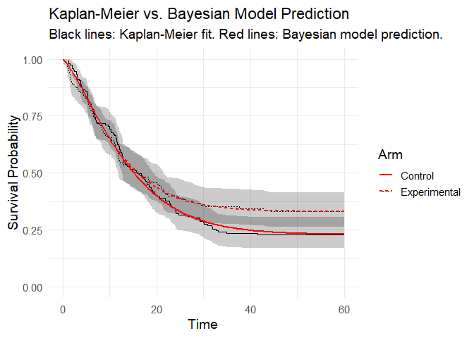<!-- -->

``` r
# 4) Obtain MCMC draws for efficacy components
outcomes_obj <- outcomes(
  fit              = bayesian_fit,
  shrinkage_method = "none"
)
```

    ## 
    ## ---
    ## Posterior correlation as an identifiability check:
    ##    Correlation: -0.016
    ##    Interpretation: Negligible (0 to -0.15): effects separable, estimation robust.
    ## ---

``` r
efficacy_draws <- get_bayescores_draws(
  fit              = bayesian_fit,
  shrinkage_method = "none"
)
```

*Disutility penalty*

Here we introduce a disutility penalty for scenarios where the majority
experiences modest harm (TR \< 1), even when a minority achieves
substantial long-term benefit. This penalty reduces the overall utility
in proportion to the magnitude of short-term harm, ensuring that large
gains for a few do not overshadow consistent detriment for many.

``` r
# 5) Final calibration for utilities & disutilities
my_final_calibration <- list(
  efficacy = list(
    cure_utility_target = list(effect_value = 0.20, utility_value = 75),
    tr_utility_target   = list(effect_value = 1.25, utility_value = 50),
    tr_disutility_target= list(effect_value = 0.85, utility_value = 20)
  )
)

# 6) Compute final BayeScores
final_utilities <- get_bayescores(
  efficacy_inputs = efficacy_draws,
  qol_scores = qol_scores,
  toxicity_scores = toxicity_output$toxicity_effect_vector,
  calibration_args = my_final_calibration
)

cat("--- Final BayeScores Summary ---\n")
```

    ## --- Final BayeScores Summary ---

``` r
plot_utility_donut(final_utilities, trial_name ="Simulated dataset (unshrinkaged)")
```

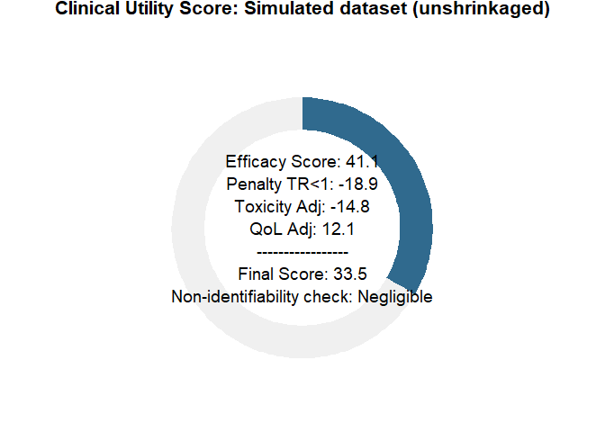<!-- -->

***Sensitivity Analysis Dashboard***

To clarify how parameter choices affect the final Bayescore and to
support model calibration, we provide a sensitivity-analysis dashboard.
It produces an 8-panel plot showing how the final utility responds to
changes in the core parameters—Time Ratio (TR), Cure Rate, Quality of
Life (QoL), and Toxicity—offering a global view of model behavior across
scenarios.

``` r
# First, we define any custom calibration arguments.
# We can use an empty list to accept the model's defaults.
calibration_settings <- list(
  efficacy = list(
    cure_utility_target = list(effect_value = 0.20, utility_value = 75),
    tr_utility_target = list(effect_value = 1.25, utility_value = 50)
  )
)


# Now, we generate the complete 8-panel dashboard
# The function will print its progress as it generates the data.
dashboard <- generate_sensitivity_dashboard(
  calibration_args = calibration_settings
)
```

    ## Generating data for all 8 plots...
    ##  Data generation complete.

``` r
# Finally, display the plot
print(dashboard)
```

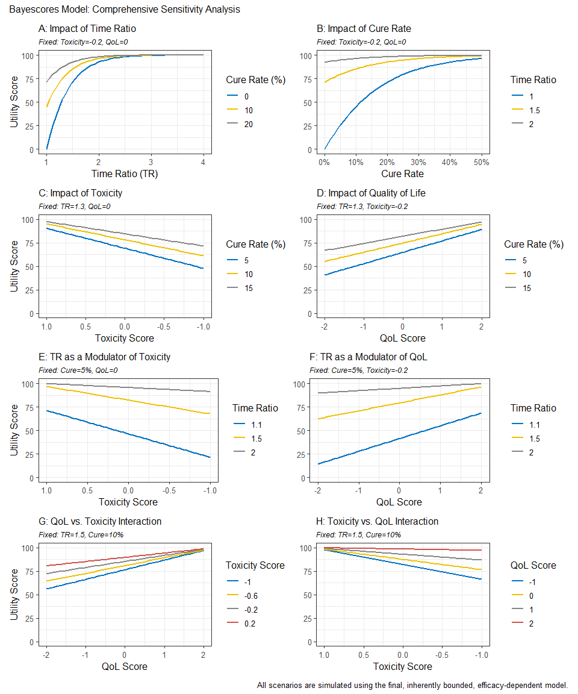<!-- -->

***Reconstructing Survival Data from Published Plots***

A perceived limitation of bayescores is its requirement for Individual
Patient Data (IPD), in contrast to other value frameworks that can use
aggregated data reported in the literature. To mitigate this limitation,
this section demonstrates a workflow to reconstruct IPD from a published
Kaplan-Meier curve image. The goal is to transform a static plot into a
usable dataset, enabling full re-analysis and custom visualization.

For this demonstration, we used Figure 2 from Hortobagyi, G. N., et
al. “Updated results from MONALEESA-2…” Annals of Oncology 29.7 (2018).
This is an Open Access article under the CC-BY-NC license.

``` r
image_path <- system.file("extdata", "mona2.png", package = "bayescores")
# install.packages("magick")

library(magick)
trial_plot <- image_read(image_path)
print(trial_plot)
```

    ## # A tibble: 1 × 7
    ##   format width height colorspace matte filesize density
    ##   <chr>  <int>  <int> <chr>      <lgl>    <int> <chr>  
    ## 1 PNG      913    478 sRGB       TRUE     34793 57x57

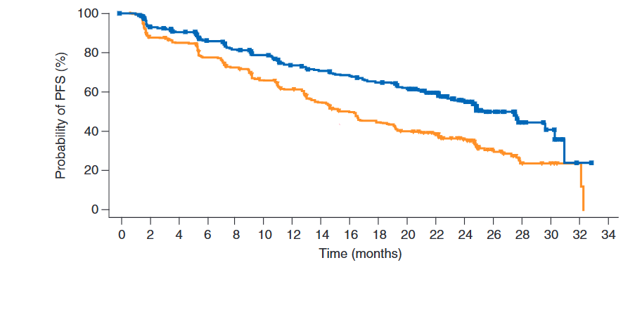

The workflow consists of three main steps:

*Digitization* We first extract the curve coordinates from the published
image. This can be done with R packages like SurvdigitizeR. If you
encounter issues, web-based tools like WebPlotDigitizer (available at
<https://automeris.io/>) are excellent alternatives. The number-at-risk
table that accompanies the plot is transcribed manually.

``` r
library(ggplot2)
library(dplyr)
library(survival)
library(survminer)
library(SurvdigitizeR)

plot_km_monaleesa <- survival_digitize(img_path = "C:/Users/Usuario/Documents/aft cure model/digitalizar/mona2.png",
                                       num_curves = 2,
                                       x_start = 0,
                                       x_end = 34,
                                       x_increment = 2,
                                       y_start = 0,
                                       y_end = 100,
                                       y_increment = 20,
                                       y_text_vertical =  T)
```

*Reconstruction* This is the core of the process. We use a programmed
version of the algorithm described by Guyot et al. (2012) to
reverse-engineer the individual event and censoring times from the
aggregated digitized data. This step effectively creates a full
patient-level dataset.

``` r
# The IPD reconstruction algorithm requires two inputs: the digitized curve
# coordinates and the number of patients at risk at specific time points.
# This data frame is a manual transcription of the "No. at risk" table
# from the published plot for both treatment arms.

nrisk_tbl_all <- rbind(
  # Data for the first curve (treatment arm)
  data.frame(
    time_tick = c(0,  2,  4,  6,  8, 10, 12, 14, 16, 18, 20, 22, 24, 26, 28, 30, 32, 34),
    nrisk     = c(334, 294, 277, 257, 240, 227, 207, 196, 188, 176, 164, 132, 97, 46, 17, 11, 1, 0),
    curve     = 1L  # Curve 1: Ribociclib + Letrozole arm
  ),
  # Data for the second curve (control arm)
  data.frame(
    time_tick = c(0,  2,  4,  6,  8, 10, 12, 14, 16, 18, 20, 22, 24, 26, 28, 30, 32, 34),
    nrisk     = c(334, 279, 265, 239, 219, 196, 179, 156, 138, 124, 110, 93, 63, 34, 10, 7, 2, 0),
    curve     = 2L  # Curve 2: Placebo + Letrozole arm
  )
)

# Now we run the core reconstruction algorithm. This is done separately for each
# treatment arm because the survival and censoring patterns are unique to each one.

# Reconstruct IPD for the first curve (Ribociclib arm)
res1 <- reconstruct_ipd(
  plot_km   = subset(plot_km_monaleesa, curve == 1), # Use digitized data for curve 1
  nrisk_tbl = subset(nrisk_tbl_all,   curve == 1)  # Use risk numbers for curve 1
)
```

    ## # A tibble: 1 × 2
    ##   curve ok   
    ##   <int> <lgl>
    ## 1     1 TRUE

``` r
# Reconstruct IPD for the second curve (Placebo arm)
res2 <- reconstruct_ipd(
  plot_km   = subset(plot_km_monaleesa, curve == 2), # Use digitized data for curve 2
  nrisk_tbl = subset(nrisk_tbl_all,   curve == 2)  # Use risk numbers for curve 2
)
```

    ## # A tibble: 1 × 2
    ##   curve ok   
    ##   <int> <lgl>
    ## 1     2 TRUE

``` r
# The final step is to merge the results from both reconstructions into a single,
# tidy dataset that is ready for analysis and plotting.

res <- list(
  # Combine the individual patient data from both arms
  ipd   = bind_rows(
    res1$ipd %>% mutate(curve = 1L), # IPD from curve 1
    res2$ipd %>% mutate(curve = 2L)  # IPD from curve 2
  ) %>%
    # Convert the numeric 'curve' column into a factor with meaningful labels.
    # This is essential for correct labeling in plots and models.
    mutate(curve = factor(curve,
                          labels = c("Placebo + letrozol",
                                     "Ribociclib + letrozol"
                                     ))),

  # 'drops' is likely a secondary output from the reconstruction function,
  # containing details about the survival probability drops. We combine it here as well.
  drops = bind_rows(
    res1$drops %>% mutate(curve = 1L),
    res2$drops %>% mutate(curve = 2L)
  )
)
```

*Re-analysis and Visualization* Once the IPD is generated, it can be
used directly within bayescores or for any other analysis. This allows
users to verify the original study’s results with survfit and coxph or
create fully customized, publication-quality plots with ggsurvplot,
providing complete analytical and visual control.

``` r
fit <- survfit(Surv(time, status) ~ curve, data = res$ipd)

ggsurvplot(
  fit,
  data = res$ipd,
  palette = c("#E69F00", "#0072B2"), # Swapped colors to match new factor levels
  conf.int = FALSE,
  censor = FALSE,
  xlab = "Time (months)",
  ylab = "Probability of PFS (%)",
  fun = "pct",
  break.time.by = 2,
  xlim = c(0, 34),
  legend.title = "",
  legend.labs = c("Ribociclib\n+ Letrozole","Placebo\n+ Letrozole"), 
  legend = c(0.75, 0.85),
  risk.table = FALSE
)
```

    ## Warning: `aes_string()` was deprecated in ggplot2 3.0.0.
    ## ℹ Please use tidy evaluation idioms with `aes()`.
    ## ℹ See also `vignette("ggplot2-in-packages")` for more information.
    ## ℹ The deprecated feature was likely used in the survminer package.
    ##   Please report the issue at <https://github.com/kassambara/survminer/issues>.
    ## This warning is displayed once every 8 hours.
    ## Call `lifecycle::last_lifecycle_warnings()` to see where this warning was
    ## generated.

    ## Warning: Using `size` aesthetic for lines was deprecated in ggplot2 3.4.0.
    ## ℹ Please use `linewidth` instead.
    ## ℹ The deprecated feature was likely used in the ggpubr package.
    ##   Please report the issue at <https://github.com/kassambara/ggpubr/issues>.
    ## This warning is displayed once every 8 hours.
    ## Call `lifecycle::last_lifecycle_warnings()` to see where this warning was
    ## generated.

    ## Warning: ggtheme is not a valid theme.
    ## Please use `theme()` to construct themes.

    ## Ignoring unknown labels:
    ## • fill : ""
    ## • linetype : "1"
    ## Ignoring unknown labels:
    ## • fill : ""
    ## • linetype : "1"

<!-- -->

## Why bayescores? a more meaningful approach

- **Clinically interpretable**: time ratios are easier to explain to
  clinicians and patients than hazard ratios, and mixture cure models
  separate short-term survival effects from the long-term survivor
  fraction. This resolves the problem of “double counting” benefit—first
  via the HR and again through a separate long-term bonus—ensuring both
  metrics remain independent.
- **Accounts for cure scenarios**: explicitly models cure rates and
  long-term survivor fractions, making it particularly relevant for
  immunotherapy and other treatments with a survival plateau.  
- **Embraces uncertainty**: the Bayesian framework propagates
  uncertainty from all model stages, displaying full posterior
  distributions rather than collapsing results into single point
  estimates.  
- **No thresholds**: uses continuous parameters and proportional weights
  rather than fixed cut-offs, producing smooth, gradual changes in the
  score. This avoids all-or-nothing jumps and makes the valuation
  process transparent, reproducible, and customizable to stakeholder
  priorities.  
- **Integrates multiple dimensions**: combines efficacy, toxicity, and
  quality of life within a unified decision-analytic framework (MAUT),
  with hierarchical aggregation that mirrors clinical reasoning:
  efficacy first, then QoL, then toxicity.  
- **Customizable toxicity weighting**: Weighted Toxicity Scores can
  incorporate grade-specific and type-specific penalties, reflecting the
  clinical relevance of different adverse events and aligning with
  disease-specific “toxicity budgets.”  
- **Accessible implementation**: provided as an open-source R package
  (`bayescores`) with full workflow examples on GitHub, including KM
  curve digitization and IPD reconstruction tools, plus a web interface
  for no-code calculation and visualization.

## Citation

``` r
citation("bayescores")
```
