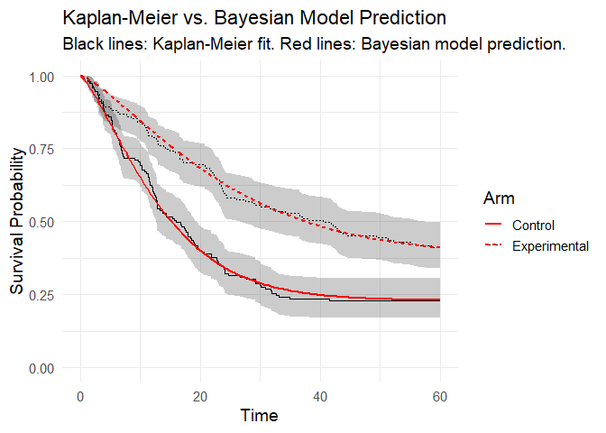
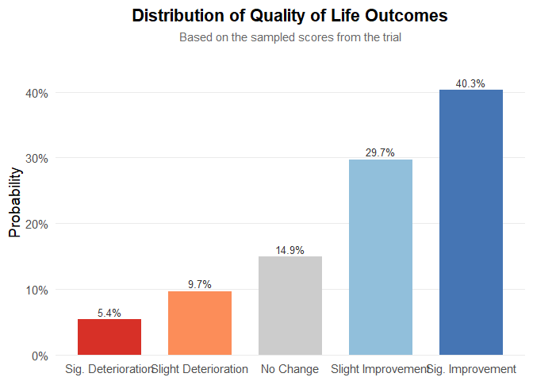

# bayescores: Comprehensive quantification of clinical benefit in randomized controlled trials using Bayesian AFT cure models

**`bayescores`** provides a comprehensive toolkit for analyzing
randomized controlled trials (RCTs). This package introduces the
**Bayesian Clinical Benefit Scores (BayeScores)**, a novel metric to
quantify clinical benefit by accounting for both survival prolongation
and cure rates.

The package includes functions to:

- Simulate realistic survival data from a mixture cure model.
- Fit Bayesian Accelerated Failure Time (AFT) mixture cure models using
  Stan.
- Visualize model results and diagnostics.
- Calculate and visualize BayeScores to provide a holistic measure of
  clinical benefit.

## Installation

Install the development version of `bayescores` from GitHub:

``` r
# install.packages("devtools")
devtools::install_github("albertocarm/bayescores")
```

## Full example

This example illustrates the complete workflow—from data simulation to
visualization of benefit scores. Here, simulated RCTs enable clear
observation of how parameter changes influence BayeScores.

### Step 1: Load the package

``` r
library(bayescores)
```

### Step 2: Simulate survival data

Simulate a 300-patient trial with long-term survival fractions of 40%
(experimental) and 20% (control), with median survival of 12 months in
the control arm. The experimental treatment extends survival by 50%
among non-cured patients.

``` r
# to work with real data, you must digitize the curves from the original paper using tools such as WebPlotDigitizer (https://automeris.io/)
# and apply the “reconstructing individual-level data” method to invert the Kaplan–Meier equations; see a tutorial at https://pharmasug.org/proceedings/2024/RW/PharmaSUG-2024-RW-125.pdf


set.seed(123)

sim_data <- simulate_weibull_cure_data(
  n_patients = 300,
  cure_fraction_ctrl = 0.20,
  cure_fraction_exp = 0.40,
  max_follow_up = 60,
  weibull_shape = 1.2,
  median_survival_ctrl = 12,
  time_ratio_exp = 1.5
)

plot_km_curves(sim_data)
```


``` r

data(package = "bayescores")
```

### Step 3: Simulate study toxicity

Generate toxicity data for a trial with 1:1 randomization (300 control
patients), baseline toxicity of 50% (any-grade), 20% severe events
(G3–4), and 1.5× higher toxicity in the experimental arm. QoL outcomes
assume “Significant Improvement” with “Very High” evidence.

**Quality of Life Parameters:**

- `qol_scenario` (expected QoL outcome):
  - `1`: **Significant Improvement**
  - `2`: **Stabilization / Probable Benefit**
  - `3`: **No Difference / Marginal Benefit**
  - `4`: **Deterioration**
  - `5`: **Insufficient Data / Unknown**
- `qol_strength` (confidence in QoL evidence):
  - `1`: **Very Low**
  - `2`: **Low**
  - `3`: **Moderate**
  - `4`: **High**
  - `5`: **Very High**

``` r
toxicity_trial <- simulate_trial_data(
  n_control = 300,
  ratio_str = "1:1",
  control_g1_4_pct = 50,
  control_g3_4_pct = 20,
  tox_ratio = 1.5,
  qol_scenario = 1,
  qol_strength = 5
)
```

Visualize toxicity with AMIT plots:

**Any-grade toxicity (Grades 1–4)**

``` r
create_amit_plot(
  trial_object = toxicity_trial,
  grade_type = "any_grade",
  main_title = "Example: Any-Grade Toxicity Profile",
  data_element = "toxicity",
  n_element = "N_patients"
)
```


**Severe toxicity (Grades 3+)**

``` r
create_amit_plot(
  trial_object = toxicity_trial,
  grade_type = "severe_grade",
  main_title = "Example: Severe-Grade (G3+) Toxicity Profile",
  data_element = "toxicity",
  n_element = "N_patients"
)
```


### Step 4: Fit the Bayesian cure model

Fit the Bayesian AFT cure model (use higher `iter` in practice):

``` r
bayesian_fit <- fit_bayesian_cure_model(
  sim_data,
  time_col = "time",
  event_col = "event",
  arm_col = "arm",
  iter = 2500,
  chains = 4
)
#> 
#> SAMPLING FOR MODEL 'anon_model' NOW (CHAIN 1).
#> Chain 1: 
#> Chain 1: Gradient evaluation took 0.000745 seconds
#> Chain 1: 1000 transitions using 10 leapfrog steps per transition would take 7.45 seconds.
#> Chain 1: Adjust your expectations accordingly!
#> Chain 1: 
#> Chain 1: 
#> Chain 1: Iteration:    1 / 2500 [  0%]  (Warmup)
#> Chain 1: Iteration:  250 / 2500 [ 10%]  (Warmup)
#> Chain 1: Iteration:  500 / 2500 [ 20%]  (Warmup)
#> Chain 1: Iteration:  750 / 2500 [ 30%]  (Warmup)
#> Chain 1: Iteration: 1000 / 2500 [ 40%]  (Warmup)
#> Chain 1: Iteration: 1001 / 2500 [ 40%]  (Sampling)
#> Chain 1: Iteration: 1250 / 2500 [ 50%]  (Sampling)
#> Chain 1: Iteration: 1500 / 2500 [ 60%]  (Sampling)
#> Chain 1: Iteration: 1750 / 2500 [ 70%]  (Sampling)
#> Chain 1: Iteration: 2000 / 2500 [ 80%]  (Sampling)
#> Chain 1: Iteration: 2250 / 2500 [ 90%]  (Sampling)
#> Chain 1: Iteration: 2500 / 2500 [100%]  (Sampling)
#> Chain 1: 
#> Chain 1:  Elapsed Time: 10.058 seconds (Warm-up)
#> Chain 1:                10.807 seconds (Sampling)
#> Chain 1:                20.865 seconds (Total)
#> Chain 1: 
#> 
#> SAMPLING FOR MODEL 'anon_model' NOW (CHAIN 2).
#> Chain 2: 
#> Chain 2: Gradient evaluation took 0.000452 seconds
#> Chain 2: 1000 transitions using 10 leapfrog steps per transition would take 4.52 seconds.
#> Chain 2: Adjust your expectations accordingly!
#> Chain 2: 
#> Chain 2: 
#> Chain 2: Iteration:    1 / 2500 [  0%]  (Warmup)
#> Chain 2: Iteration:  250 / 2500 [ 10%]  (Warmup)
#> Chain 2: Iteration:  500 / 2500 [ 20%]  (Warmup)
#> Chain 2: Iteration:  750 / 2500 [ 30%]  (Warmup)
#> Chain 2: Iteration: 1000 / 2500 [ 40%]  (Warmup)
#> Chain 2: Iteration: 1001 / 2500 [ 40%]  (Sampling)
#> Chain 2: Iteration: 1250 / 2500 [ 50%]  (Sampling)
#> Chain 2: Iteration: 1500 / 2500 [ 60%]  (Sampling)
#> Chain 2: Iteration: 1750 / 2500 [ 70%]  (Sampling)
#> Chain 2: Iteration: 2000 / 2500 [ 80%]  (Sampling)
#> Chain 2: Iteration: 2250 / 2500 [ 90%]  (Sampling)
#> Chain 2: Iteration: 2500 / 2500 [100%]  (Sampling)
#> Chain 2: 
#> Chain 2:  Elapsed Time: 8.706 seconds (Warm-up)
#> Chain 2:                10.754 seconds (Sampling)
#> Chain 2:                19.46 seconds (Total)
#> Chain 2: 
#> 
#> SAMPLING FOR MODEL 'anon_model' NOW (CHAIN 3).
#> Chain 3: 
#> Chain 3: Gradient evaluation took 0.000237 seconds
#> Chain 3: 1000 transitions using 10 leapfrog steps per transition would take 2.37 seconds.
#> Chain 3: Adjust your expectations accordingly!
#> Chain 3: 
#> Chain 3: 
#> Chain 3: Iteration:    1 / 2500 [  0%]  (Warmup)
#> Chain 3: Iteration:  250 / 2500 [ 10%]  (Warmup)
#> Chain 3: Iteration:  500 / 2500 [ 20%]  (Warmup)
#> Chain 3: Iteration:  750 / 2500 [ 30%]  (Warmup)
#> Chain 3: Iteration: 1000 / 2500 [ 40%]  (Warmup)
#> Chain 3: Iteration: 1001 / 2500 [ 40%]  (Sampling)
#> Chain 3: Iteration: 1250 / 2500 [ 50%]  (Sampling)
#> Chain 3: Iteration: 1500 / 2500 [ 60%]  (Sampling)
#> Chain 3: Iteration: 1750 / 2500 [ 70%]  (Sampling)
#> Chain 3: Iteration: 2000 / 2500 [ 80%]  (Sampling)
#> Chain 3: Iteration: 2250 / 2500 [ 90%]  (Sampling)
#> Chain 3: Iteration: 2500 / 2500 [100%]  (Sampling)
#> Chain 3: 
#> Chain 3:  Elapsed Time: 9.195 seconds (Warm-up)
#> Chain 3:                11.503 seconds (Sampling)
#> Chain 3:                20.698 seconds (Total)
#> Chain 3: 
#> 
#> SAMPLING FOR MODEL 'anon_model' NOW (CHAIN 4).
#> Chain 4: 
#> Chain 4: Gradient evaluation took 0.000796 seconds
#> Chain 4: 1000 transitions using 10 leapfrog steps per transition would take 7.96 seconds.
#> Chain 4: Adjust your expectations accordingly!
#> Chain 4: 
#> Chain 4: 
#> Chain 4: Iteration:    1 / 2500 [  0%]  (Warmup)
#> Chain 4: Iteration:  250 / 2500 [ 10%]  (Warmup)
#> Chain 4: Iteration:  500 / 2500 [ 20%]  (Warmup)
#> Chain 4: Iteration:  750 / 2500 [ 30%]  (Warmup)
#> Chain 4: Iteration: 1000 / 2500 [ 40%]  (Warmup)
#> Chain 4: Iteration: 1001 / 2500 [ 40%]  (Sampling)
#> Chain 4: Iteration: 1250 / 2500 [ 50%]  (Sampling)
#> Chain 4: Iteration: 1500 / 2500 [ 60%]  (Sampling)
#> Chain 4: Iteration: 1750 / 2500 [ 70%]  (Sampling)
#> Chain 4: Iteration: 2000 / 2500 [ 80%]  (Sampling)
#> Chain 4: Iteration: 2250 / 2500 [ 90%]  (Sampling)
#> Chain 4: Iteration: 2500 / 2500 [100%]  (Sampling)
#> Chain 4: 
#> Chain 4:  Elapsed Time: 13.607 seconds (Warm-up)
#> Chain 4:                15.559 seconds (Sampling)
#> Chain 4:                29.166 seconds (Total)
#> Chain 4:
```

### Step 5: Analyze and visualize model results

The mixture cure model separates individuals into:

- **Cured (long-term survivors)**: negligible event risk long-term.
- **Susceptible (uncured)**: ongoing event risk; survival prolonged but
  not cured.

Inspect numerical summaries and visualize posterior distributions. You
can verify that the model satisfactorily recovers the time ratio and the
fractions of long‑term survivors:

``` r
print(bayesian_fit$stan_fit, pars = c("beta_cure_arm", "beta_surv_arm", "alpha"))
#> Inference for Stan model: anon_model.
#> 4 chains, each with iter=2500; warmup=1000; thin=1; 
#> post-warmup draws per chain=1500, total post-warmup draws=6000.
#> 
#>               mean se_mean   sd 2.5%  25%  50%  75% 97.5% n_eff Rhat
#> beta_cure_arm 0.71    0.01 0.29 0.15 0.53 0.71 0.91  1.27  2971    1
#> beta_surv_arm 0.57    0.00 0.15 0.31 0.47 0.56 0.65  0.88  3232    1
#> alpha         1.33    0.00 0.09 1.16 1.27 1.33 1.39  1.50  4060    1
#> 
#> Samples were drawn using NUTS(diag_e) at Sun Jul 27 10:59:09 2025.
#> For each parameter, n_eff is a crude measure of effective sample size,
#> and Rhat is the potential scale reduction factor on split chains (at 
#> convergence, Rhat=1).
outcomes(bayesian_fit)
#> # A tibble: 5 × 2
#>   Metric                                     `Result (95% CI)`    
#>   <chr>                                      <chr>                
#> 1 Time Ratio (TR)                            1.75 (1.36 - 2.42)   
#> 2 Odds Ratio (OR) for Cure                   2.04 (1.16 - 3.55)   
#> 3 Long-Term Survival Rate (%) - Control      22.80 (16.29 - 30.10)
#> 4 Long-Term Survival Rate (%) - Experimental 37.79 (27.67 - 46.35)
#> 5 Absolute Difference in Survival Rate (%)   14.84 (2.99 - 25.83)
```

**Posterior distributions**

``` r
plot_densities(bayesian_fit)
```

<div class="figure">


<p class="caption">

Figure 1: Posterior density distributions for Time Ratio, Odds Ratio of
Cure, and Cure Probability Difference.
</p>

</div>

**Posterior predictive check** You can observe how the model’s
predictions align satisfactorily with the Kaplan–Meier estimator:

``` r
plot(bayesian_fit)
```

<div class="figure">


<p class="caption">

Figure 2: Posterior predictive check (model vs Kaplan-Meier data).
</p>

</div>

### Step 6: Integrate toxicity data

Toxicity is summarized by a burden‑of‑toxicity score, which weights both
the severity and the category of toxicity (see technical documentation).
Estimates below zero, as observed here, indicate greater toxicity in the
experimental arm, consistent with the simulation:

``` r
toxicity_output <- calculate_toxicity_adjustment(
  trial_data = toxicity_trial,
  n_simulations = length(bayesian_fit$posterior_draws)
)

plot_toxicity_adjustment(toxicity_output)
#> Picking joint bandwidth of 0.0265
```

<div class="figure">


<p class="caption">

Figure 3: Distribution of burden-of-toxicity score.
</p>

</div>

### Step 7: Quality-of-life weighting

QoL adjustments modeled using multinomial distribution:

``` r
qol_scores <- sample_qol_scores(
  prob_vector = toxicity_trial$qol,
  n_samples = length(bayesian_fit$posterior_draws)
)

plot_qol_histogram(qol_scores)
```

<div class="figure">


<p class="caption">

Figure 4: Multinomial distribution of QoL levels.
</p>

</div>

We have chosen this methodology because quality‑of‑life data are
published very inconsistently—indeed, the data are a mess—and the
approach will likely evolve over time. Therefore, you must read the
paper, qualitatively interpret the results, and assess both the impact
on quality of life and the strength of evidence. The outcome will be a
multinomial distribution, as shown below. It is quite straightforward:
to work with real data, the package includes the function
generate_qol_vector(), which interactively generates a quality‑of‑life
(QoL) probability vector.

### Step 8: Extract posterior samples and compute BayeScores

Okay, we have everything: efficacy, toxicity, QoL. It’s time to extract
posterior samples and compute BayeScores.

To obtain utility, a cumulative logistic function is used, anchored by
the minimum clinically relevant benefit values, which we—two
oncologists—have agreed upon as the time ratio of 1.15 (e.g., extending
OS from 10 to 11.5 months) or a long‑term survival increase of 4 %.

Inspired by multi‑attribute utility theory (MAUT), we have also chosen
the thresholds at which drugs become not only active but promising: a
time ratio of 1.35 and a survival‑rate difference of 12 %.

Now, look at the output. To derive final utilities, an adaptive policy
is applied: the function has detected that this clinical trial increases
the long‑term survivor rate and has adjusted the weighting scores
relative to the predefined ones (see technical specification).

``` r
efficacy_inputs <- list(
  tr_posterior_samples = extract_mcmc_time_ratios(bayesian_fit),
  cure_posterior_samples = extract_mcmc_cure_diffs(bayesian_fit)
)

final_utilities <- summarize_final_utility(
  efficacy_scores = efficacy_inputs,
  toxicity_scores = toxicity_output$adjustment_vector,
  qol_scores = qol_scores,
  weights_if_no_cure = c(tr=0.7, cure=0.1, tox=0.1, qol=0.1),
  weights_if_cure = c(tr=0.15, cure=0.6, tox=0.15, qol=0.1),
  tr_min_if_no_cure = 1.15,
  tr_hopeful = 1.35,
  cure_min_relevant = 0.04,
  cure_hopeful = 0.12
)
#> Info: P(Cure Benefit > 0.02) = 0.98. Profile detected: 'Cure'.
#> Info: 'Cure' profile. Median cure diff=0.148 -> Dominance Factor=0.62
#> Info: QoL magnitude is 0.75. Applying gradual weighting.
#> Info: Final adjusted weights -> tr 0.294, cure 0.477, tox 0.154, qol 0.075

print(final_utilities$component_summary)
#>                          Component     Median Lower_95_CrI Upper_95_CrI
#> 1      1. -> Score TR (Calibrated)  93.009516    71.845939    99.689848
#> 2         2. -> Score Cure (0-100)  52.921441     8.224687    92.141417
#> 3    3. -> Score Toxicity (scaled) -39.367554   -48.065171   -35.689099
#> 4         4. -> Score QoL (scaled)  75.000000   -41.250000   100.000000
#> 5       Contribution TR (Weighted)  27.335328    21.115391    29.298666
#> 6     Contribution Cure (Weighted)  25.240095     3.922642    43.945480
#> 7 Contribution Toxicity (Weighted)  -6.069165    -7.410047    -5.502069
#> 8      Contribution QoL (Weighted)   5.625000    -3.093750     7.500000
#> 9              FINAL UTILITY SCORE  49.425658    26.114988    70.522292
```

### Step 9: Visualize final clinical benefit

**BayeScore donut plot**

After these analyses, the tool delivers a final *clinical utility score*
derived from all the weightings, representing the drug’s ultimate
evaluation. This score is based on a simulation that assumed benefit but
also factored in some toxicity, yet still resulted in an improvement in
quality of life.

``` r
plot_utility_donut(final_utilities)
#> Enter the trial name for the plot title:
```

<div class="figure">


<p class="caption">

Figure 5: BayeScore donut plot.
</p>

</div>

**Final score posterior distribution**

It’s clear that estimating clinical benefit carries substantial
uncertainty—studies are noisy, and sample sizes are limited. We’ve
rigorously propagated every source of uncertainty throughout the
analysis, so that you alone judge the credibility of the results.

That is the power of the BayeScore: it isn’t a single point estimate but
a full Bayesian distribution!

``` r
plot_final_utility_density(final_utilities)
```

<div class="figure">


<p class="caption">

Figure 6: Final BayeScore posterior distribution.
</p>

</div>

## Why bayescores? a more meaningful approach

- **Clinically interpretable**: time ratios are more intuitive than
  hazard ratios; cure models resolve the issue of double counting
  benefit—first in HR terms and again as the long‑term bonus. this
  ensures both metrics remain independent.  
- **Accounts for cure scenarios**: explicit modeling of cure rates and
  long‑term survivor fractions in immunotherapy studies.  
- **Embraces uncertainty**: the Bayesian framework transparently conveys
  uncertainty.  
- **No thresholds**: there are parameters and weights, but the approach
  is gradual; it avoids all‑or‑nothing decisions and is transparent and
  customizable.

## Citation

``` r
citation("bayescores")
```
