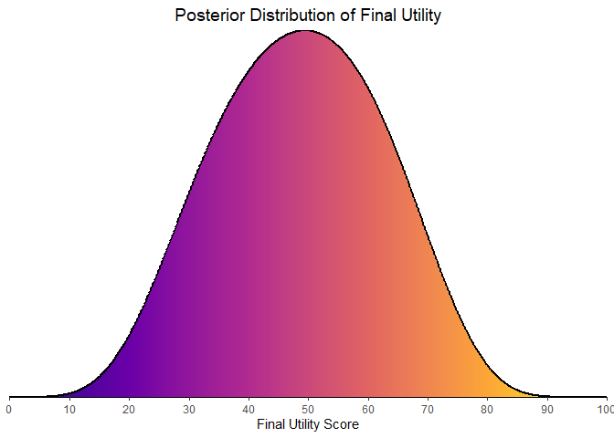

# bayescores: Comprehensive Quantification of Clinical Benefit in Randomized Controlled Trials using Bayesian AFT Cure Models

**`bayescores`** provides a comprehensive toolkit for analyzing
randomized controlled trials (RCTs). This package introduces the
**Bayesian Clinical Benefit Scores (BayeScores)**, a novel metric to
quantify the magnitude of clinical benefit by accounting for both
survival prolongation and cure rates.

The package includes functions to:

- Simulate realistic survival data from a mixture cure model.
- Fit Bayesian Accelerated Failure Time (AFT) mixture cure models using
  Stan.
- Visualize model results and diagnostics.
- Calculate and visualize BayeScores to provide a holistic measure of
  clinical benefit.

## Installation

You can install the development version of `bayescores` from GitHub
with:

``` r
# install.packages("devtools")
devtools::install_github("albertocarm/bayescores")
```

## Full example

This example demonstrates the complete workflow, from data simulation to
benefit score visualization.

### Step 1: Load the Package

First, we load the `bayescores` library to get access to all its
functions.

``` r
library(bayescores)
```

### Step 2: Simulate Survival Data

We begin by simulating a dataset for a two-arm clinical trial using a
Weibull cure model. This function allows us to define the cure rates and
survival characteristics for each arm.

``` r
sim_data <- simulate_weibull_cure_data(
  n_patients = 200,
  cure_fraction_ctrl = 0.20,
  cure_fraction_exp = 0.40,
  max_follow_up = 60,
  weibull_shape = 1.2,
  median_survival_ctrl = 18,
  time_ratio_exp = 1.5
)

# Visualize the simulated data with Kaplan-Meier curves
plot_km_curves(sim_data)
```


``` r

# The library also includes multiple digitized datasets from actual clinical trials (facsimiles) across curative and non-curative settings, featuring various therapies such as chemotherapy, targeted therapies, and immunotherapy. The datasets include survival curves with diverse morphologies, late effects, crossing hazards, etc.

data(package = "bayescores")
```

### Step 3: Fit the Bayesian Cure Model

Next, we fit our Bayesian AFT cure model to the simulated data. For a
real analysis, you should use a higher number of iterations (e.g.,
`iter = 4000`).

``` r
# Note: Using fewer iterations for this example to run quickly.
bayesian_fit <- fit_bayesian_cure_model(sim_data,
  time_col = "time",
  event_col = "event",
  arm_col = "arm",
  iter = 2500, chains = 4)
#> 
#> SAMPLING FOR MODEL 'anon_model' NOW (CHAIN 1).
#> Chain 1: 
#> Chain 1: Gradient evaluation took 0.000143 seconds
#> Chain 1: 1000 transitions using 10 leapfrog steps per transition would take 1.43 seconds.
#> Chain 1: Adjust your expectations accordingly!
#> Chain 1: 
#> Chain 1: 
#> Chain 1: Iteration:    1 / 2500 [  0%]  (Warmup)
#> Chain 1: Iteration:  250 / 2500 [ 10%]  (Warmup)
#> Chain 1: Iteration:  500 / 2500 [ 20%]  (Warmup)
#> Chain 1: Iteration:  750 / 2500 [ 30%]  (Warmup)
#> Chain 1: Iteration: 1000 / 2500 [ 40%]  (Warmup)
#> Chain 1: Iteration: 1001 / 2500 [ 40%]  (Sampling)
#> Chain 1: Iteration: 1250 / 2500 [ 50%]  (Sampling)
#> Chain 1: Iteration: 1500 / 2500 [ 60%]  (Sampling)
#> Chain 1: Iteration: 1750 / 2500 [ 70%]  (Sampling)
#> Chain 1: Iteration: 2000 / 2500 [ 80%]  (Sampling)
#> Chain 1: Iteration: 2250 / 2500 [ 90%]  (Sampling)
#> Chain 1: Iteration: 2500 / 2500 [100%]  (Sampling)
#> Chain 1: 
#> Chain 1:  Elapsed Time: 7.094 seconds (Warm-up)
#> Chain 1:                6.892 seconds (Sampling)
#> Chain 1:                13.986 seconds (Total)
#> Chain 1: 
#> 
#> SAMPLING FOR MODEL 'anon_model' NOW (CHAIN 2).
#> Chain 2: 
#> Chain 2: Gradient evaluation took 8.4e-05 seconds
#> Chain 2: 1000 transitions using 10 leapfrog steps per transition would take 0.84 seconds.
#> Chain 2: Adjust your expectations accordingly!
#> Chain 2: 
#> Chain 2: 
#> Chain 2: Iteration:    1 / 2500 [  0%]  (Warmup)
#> Chain 2: Iteration:  250 / 2500 [ 10%]  (Warmup)
#> Chain 2: Iteration:  500 / 2500 [ 20%]  (Warmup)
#> Chain 2: Iteration:  750 / 2500 [ 30%]  (Warmup)
#> Chain 2: Iteration: 1000 / 2500 [ 40%]  (Warmup)
#> Chain 2: Iteration: 1001 / 2500 [ 40%]  (Sampling)
#> Chain 2: Iteration: 1250 / 2500 [ 50%]  (Sampling)
#> Chain 2: Iteration: 1500 / 2500 [ 60%]  (Sampling)
#> Chain 2: Iteration: 1750 / 2500 [ 70%]  (Sampling)
#> Chain 2: Iteration: 2000 / 2500 [ 80%]  (Sampling)
#> Chain 2: Iteration: 2250 / 2500 [ 90%]  (Sampling)
#> Chain 2: Iteration: 2500 / 2500 [100%]  (Sampling)
#> Chain 2: 
#> Chain 2:  Elapsed Time: 4.417 seconds (Warm-up)
#> Chain 2:                7.569 seconds (Sampling)
#> Chain 2:                11.986 seconds (Total)
#> Chain 2: 
#> 
#> SAMPLING FOR MODEL 'anon_model' NOW (CHAIN 3).
#> Chain 3: 
#> Chain 3: Gradient evaluation took 8e-05 seconds
#> Chain 3: 1000 transitions using 10 leapfrog steps per transition would take 0.8 seconds.
#> Chain 3: Adjust your expectations accordingly!
#> Chain 3: 
#> Chain 3: 
#> Chain 3: Iteration:    1 / 2500 [  0%]  (Warmup)
#> Chain 3: Iteration:  250 / 2500 [ 10%]  (Warmup)
#> Chain 3: Iteration:  500 / 2500 [ 20%]  (Warmup)
#> Chain 3: Iteration:  750 / 2500 [ 30%]  (Warmup)
#> Chain 3: Iteration: 1000 / 2500 [ 40%]  (Warmup)
#> Chain 3: Iteration: 1001 / 2500 [ 40%]  (Sampling)
#> Chain 3: Iteration: 1250 / 2500 [ 50%]  (Sampling)
#> Chain 3: Iteration: 1500 / 2500 [ 60%]  (Sampling)
#> Chain 3: Iteration: 1750 / 2500 [ 70%]  (Sampling)
#> Chain 3: Iteration: 2000 / 2500 [ 80%]  (Sampling)
#> Chain 3: Iteration: 2250 / 2500 [ 90%]  (Sampling)
#> Chain 3: Iteration: 2500 / 2500 [100%]  (Sampling)
#> Chain 3: 
#> Chain 3:  Elapsed Time: 4.055 seconds (Warm-up)
#> Chain 3:                5.074 seconds (Sampling)
#> Chain 3:                9.129 seconds (Total)
#> Chain 3: 
#> 
#> SAMPLING FOR MODEL 'anon_model' NOW (CHAIN 4).
#> Chain 4: 
#> Chain 4: Gradient evaluation took 9.1e-05 seconds
#> Chain 4: 1000 transitions using 10 leapfrog steps per transition would take 0.91 seconds.
#> Chain 4: Adjust your expectations accordingly!
#> Chain 4: 
#> Chain 4: 
#> Chain 4: Iteration:    1 / 2500 [  0%]  (Warmup)
#> Chain 4: Iteration:  250 / 2500 [ 10%]  (Warmup)
#> Chain 4: Iteration:  500 / 2500 [ 20%]  (Warmup)
#> Chain 4: Iteration:  750 / 2500 [ 30%]  (Warmup)
#> Chain 4: Iteration: 1000 / 2500 [ 40%]  (Warmup)
#> Chain 4: Iteration: 1001 / 2500 [ 40%]  (Sampling)
#> Chain 4: Iteration: 1250 / 2500 [ 50%]  (Sampling)
#> Chain 4: Iteration: 1500 / 2500 [ 60%]  (Sampling)
#> Chain 4: Iteration: 1750 / 2500 [ 70%]  (Sampling)
#> Chain 4: Iteration: 2000 / 2500 [ 80%]  (Sampling)
#> Chain 4: Iteration: 2250 / 2500 [ 90%]  (Sampling)
#> Chain 4: Iteration: 2500 / 2500 [100%]  (Sampling)
#> Chain 4: 
#> Chain 4:  Elapsed Time: 4.25 seconds (Warm-up)
#> Chain 4:                5.835 seconds (Sampling)
#> Chain 4:                10.085 seconds (Total)
#> Chain 4:
```

### Step 4: Analyze and Visualize Model Results

Once the model is fitted, we can inspect the results.

First, a **numerical summary** of the key parameters helps us understand
the model’s estimates for the treatment effect on the cure and survival
components.

``` r
# Check the numerical results for the main parameters
print(bayesian_fit$stan_fit, pars = c("beta_cure_arm", "beta_surv_arm", "alpha"))
#> Inference for Stan model: anon_model.
#> 4 chains, each with iter=2500; warmup=1000; thin=1; 
#> post-warmup draws per chain=1500, total post-warmup draws=6000.
#> 
#>                mean se_mean   sd  2.5%   25%   50%  75% 97.5% n_eff Rhat
#> beta_cure_arm -0.63    0.05 1.99 -5.02 -1.85 -0.40 0.70  2.89  1910    1
#> beta_surv_arm  0.56    0.01 0.26  0.01  0.41  0.57 0.73  1.04  2091    1
#> alpha          1.11    0.00 0.10  0.93  1.04  1.11 1.18  1.34  1826    1
#> 
#> Samples were drawn using NUTS(diag_e) at Sun Jul 20 19:40:22 2025.
#> For each parameter, n_eff is a crude measure of effective sample size,
#> and Rhat is the potential scale reduction factor on split chains (at 
#> convergence, Rhat=1).
```

We can then **visualize the posterior distributions** of these
parameters. This is crucial for understanding the uncertainty and the
magnitude of the effects.

``` r
# Plot the posterior densities of the main effect parameters
plot_densities(bayesian_fit)
```

<div class="figure">


<p class="caption">

Figure 1: Posterior density distributions for the Time Ratio, Odds Ratio
of being cured, and the difference in cure probability.
</p>

</div>

We can also generate a **posterior predictive check**, which overlays
the model’s predicted survival curves on top of the empirical
Kaplan-Meier curves. A good fit means the red lines (model) should
closely follow the black lines (data).

``` r
# Plot the model fit against the data
plot(bayesian_fit)
```

<div class="figure">


<p class="caption">

Figure 2: Posterior predictive check. The model’s predicted survival
curves (red) are overlaid on the Kaplan-Meier curves from the data
(black).
</p>

</div>

### Step 5: Calculate the BayeScores

With the model fitted, we extract the posterior samples for the Time
Ratio and the cure rate difference. These are the two pillars of
clinical benefit that we will use to calculate the BayeScores.

``` r
# Extract MCMC draws for the two benefit components
tr_draws <- extract_mcmc_time_ratios(bayesian_fit)
cure_diff_draws <- extract_mcmc_cure_diffs(bayesian_fit)

# Calculate the BayeScores based on predefined utility thresholds
scores_list <- calculate_bayescores(
  tr_posterior_samples = tr_draws,
  cure_posterior_samples = cure_diff_draws,
  tr_mean = 1.25,
  tr_max = 1.5,
  cure_mean = 0.1,
  cure_max = 0.2,
  tr_weight = 0.8
)

# Print a numerical summary of the final score
summarize_bayescores(scores_list)
#> --- BayeScore Final Summary ---
#> Median Score : 80.00
#> 95% CrI      : [20.08, 96.16]
#> 5-Level Score: 4.20
#> -----------------------------
```

### Step 6: Visualize the Final Clinical Benefit

Finally, we visualize the BayeScore result. The **donut plot** provides
an intuitive summary of the overall benefit and its sources.

``` r
# Generate the donut plot from the scores list
plot_bayes_donut(scores_list)
```

<div class="figure">


<p class="caption">

Figure 3: BayeScore donut plot, showing the final median score and the
contribution from the Time Ratio and Cure Rate components.
</p>

</div>

To fully appreciate the **uncertainty**, we also plot the entire
posterior distribution of the final score. A narrow, peaked distribution
indicates higher confidence in the result.

``` r
# Visualize the full posterior distribution of the score
plot_bayes_dist(scores_list)
```

<div class="figure">


<p class="caption">

Figure 4: Posterior distribution of the final BayeScore, illustrating
the uncertainty around the median estimate.
</p>

</div>

## Why BayeScores? A More Meaningful Approach

The BayeScores framework is designed to overcome the limitations of
traditional metrics like the **Hazard Ratio (HR)**.

- **Clinically Interpretable**: It moves beyond the HR, which is a
  relative measure that is often misinterpreted. BayeScores, based on
  survival time and cure rates, are more intuitive.
- **Accounts for Cure Scenarios**: It explicitly models and
  distinguishes between curative and non-curative scenarios by
  incorporating a cure fraction.
- **Embraces Uncertainty**: Thanks to the **Bayesian framework**, it
  doesn’t just provide a single number. It carries forward the full
  spectrum of uncertainty into the final score, providing a transparent
  and honest assessment of the evidence, which is crucial for
  high-stakes decisions by clinicians and payers.

## Citation

If you use `bayesCure` in your research, please cite the package and the
associated publication.

``` r
# To get citation information for the package
citation("bayesCure")
```
