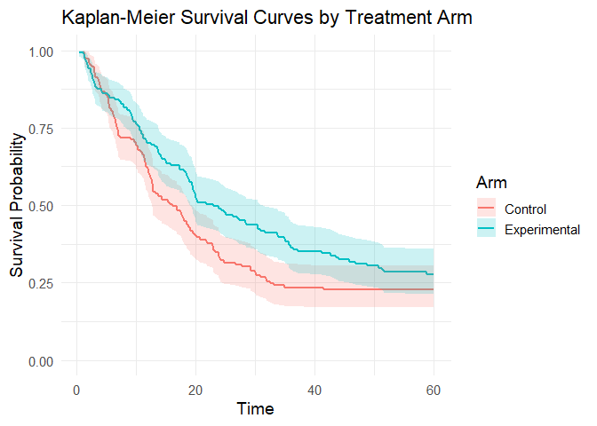
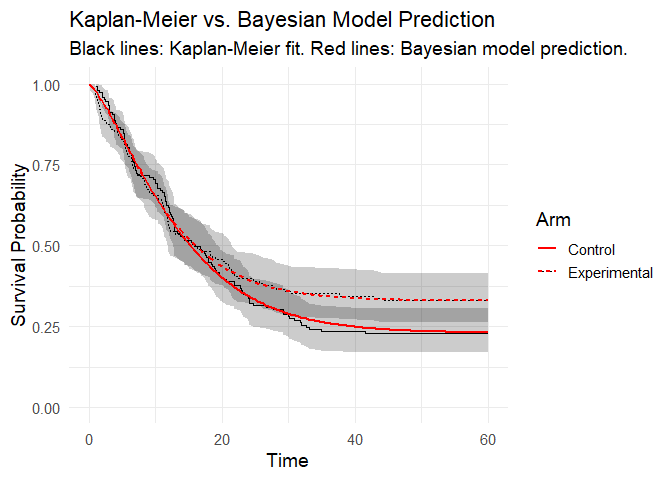
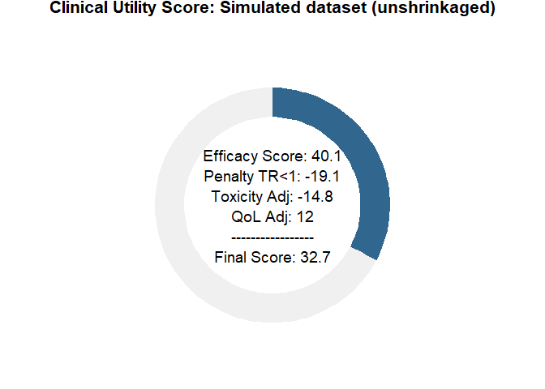

---

# bayescores: Comprehensive quantification of clinical benefit in randomized controlled trials using Bayesian AFT cure models

**`bayescores`** provides a comprehensive toolkit for analyzing
randomized controlled trials (RCTs). This package introduces the
**Bayesian Clinical Benefit Scores (BayeScores)**, a novel metric to
quantify clinical benefit by accounting for both survival prolongation
and cure rates.

The package includes functions to:

- Simulate realistic survival data from a mixture cure model.
- Fit Bayesian Accelerated Failure Time (AFT) mixture cure models using
  Stan.
- Visualize model results and diagnostics.
- Calculate and visualize BayeScores to provide a holistic measure of
  clinical benefit.

## Installation

Install the development version of `bayescores` from GitHub:

``` r
# install.packages("devtools")
devtools::install_github("albertocarm/bayescores")
```

## Full example

This example illustrates the complete workflow—from data simulation to
visualization of benefit scores. Here, simulated RCTs enable clear
observation of how parameter changes influence BayeScores.

### Step 1: Load the package

``` r
library(bayescores)
```

### Step 2: Simulate survival data

Simulate a 300-patient trial with long-term survival fractions of 30%
(experimental) vs. 20% (control), and a median survival of 12 months in
the control arm. The experimental arm gets a 25% survival boost among
non-cured patients.

These parameters are intentionally set for low evidence — a toy example
to show off the package’s ability not just to measure clinical benefit,
but to adjust it and keep bias under control.

``` r
set.seed(123)

sim_data <- simulate_weibull_cure_data(
  n_patients = 300,
  cure_fraction_ctrl = 0.20,
  cure_fraction_exp = 0.30,
  max_follow_up = 60,
  weibull_shape = 1.2,
  median_survival_ctrl = 12,
  time_ratio_exp = 1.25
)

plot_km_curves(sim_data)
```

<!-- -->

``` r
data(package = "bayescores")
```

### Step 3: Simulate study toxicity

Generate toxicity data for a trial with 1:1 randomization (150 control
patients), baseline toxicity of 50% (any-grade), 20% severe events
(G3–4), and 1.5× higher toxicity in the experimental arm. QoL outcomes
assume “Significant Improvement” with “Very High” evidence.

**Quality of Life Parameters:**

- `qol_scenario` (expected QoL outcome):

- `1`: **Significant Improvement**

- `2`: **Stabilization / Probable Benefit**

- `3`: **No Difference / Marginal Benefit**

- `4`: **Deterioration**

- `5`: **Insufficient Data / Unknown**

- `qol_strength` (confidence in QoL evidence):

- `1`: **Very Low**

- `2`: **Low**

- `3`: **Moderate**

- `4`: **High**

- `5`: **Very High**

``` r
toxicity_trial <- simulate_trial_data(
  n_control = 150,
  ratio_str = "1:1",
  control_g1_4_pct = 50,
  control_g3_4_pct = 20,
  tox_ratio = 1.5,
  qol_scenario = 1,
  qol_strength = 5
)
```

To analyze toxicity in *non-simulated data*, you obviously need to go to
the actual toxicity table, look up the quality-of-life articles
associated with that trial, and manually fill in an object similar to
the one produced by the simulate_trial_data function.

Visualize toxicity with AMIT plots:

**Any-grade toxicity (Grades 1–4)**

``` r
create_amit_plot(
  trial_object = toxicity_trial,
  grade_type = "any_grade",
  main_title = "Example: Any-Grade Toxicity Profile",
  data_element = "toxicity",
  n_element = "N_patients"
)
```

<!-- -->

**Severe toxicity (Grades 3+)**

``` r
create_amit_plot(
  trial_object = toxicity_trial,
  grade_type = "severe_grade",
  main_title = "Example: Severe-Grade (G3+) Toxicity Profile",
  data_element = "toxicity",
  n_element = "N_patients"
)
```

<!-- -->

### Step 4: Fit the Bayesian cure model

Fit the Bayesian AFT cure model (use higher `iter` in practice):

``` r
bayesian_fit <- fit_bayesian_cure_model(
  sim_data,
  time_col = "time",
  event_col = "event",
  arm_col = "arm",
  iter = 2500,
  chains = 4
)
```

    ## 
    ## SAMPLING FOR MODEL 'anon_model' NOW (CHAIN 1).
    ## Chain 1: 
    ## Chain 1: Gradient evaluation took 0.00085 seconds
    ## Chain 1: 1000 transitions using 10 leapfrog steps per transition would take 8.5 seconds.
    ## Chain 1: Adjust your expectations accordingly!
    ## Chain 1: 
    ## Chain 1: 
    ## Chain 1: Iteration:    1 / 2500 [  0%]  (Warmup)
    ## Chain 1: Iteration:  250 / 2500 [ 10%]  (Warmup)
    ## Chain 1: Iteration:  500 / 2500 [ 20%]  (Warmup)
    ## Chain 1: Iteration:  750 / 2500 [ 30%]  (Warmup)
    ## Chain 1: Iteration: 1000 / 2500 [ 40%]  (Warmup)
    ## Chain 1: Iteration: 1001 / 2500 [ 40%]  (Sampling)
    ## Chain 1: Iteration: 1250 / 2500 [ 50%]  (Sampling)
    ## Chain 1: Iteration: 1500 / 2500 [ 60%]  (Sampling)
    ## Chain 1: Iteration: 1750 / 2500 [ 70%]  (Sampling)
    ## Chain 1: Iteration: 2000 / 2500 [ 80%]  (Sampling)
    ## Chain 1: Iteration: 2250 / 2500 [ 90%]  (Sampling)
    ## Chain 1: Iteration: 2500 / 2500 [100%]  (Sampling)
    ## Chain 1: 
    ## Chain 1:  Elapsed Time: 10.811 seconds (Warm-up)
    ## Chain 1:                11.734 seconds (Sampling)
    ## Chain 1:                22.545 seconds (Total)
    ## Chain 1: 
    ## 
    ## SAMPLING FOR MODEL 'anon_model' NOW (CHAIN 2).
    ## Chain 2: 
    ## Chain 2: Gradient evaluation took 0.000622 seconds
    ## Chain 2: 1000 transitions using 10 leapfrog steps per transition would take 6.22 seconds.
    ## Chain 2: Adjust your expectations accordingly!
    ## Chain 2: 
    ## Chain 2: 
    ## Chain 2: Iteration:    1 / 2500 [  0%]  (Warmup)
    ## Chain 2: Iteration:  250 / 2500 [ 10%]  (Warmup)
    ## Chain 2: Iteration:  500 / 2500 [ 20%]  (Warmup)
    ## Chain 2: Iteration:  750 / 2500 [ 30%]  (Warmup)
    ## Chain 2: Iteration: 1000 / 2500 [ 40%]  (Warmup)
    ## Chain 2: Iteration: 1001 / 2500 [ 40%]  (Sampling)
    ## Chain 2: Iteration: 1250 / 2500 [ 50%]  (Sampling)
    ## Chain 2: Iteration: 1500 / 2500 [ 60%]  (Sampling)
    ## Chain 2: Iteration: 1750 / 2500 [ 70%]  (Sampling)
    ## Chain 2: Iteration: 2000 / 2500 [ 80%]  (Sampling)
    ## Chain 2: Iteration: 2250 / 2500 [ 90%]  (Sampling)
    ## Chain 2: Iteration: 2500 / 2500 [100%]  (Sampling)
    ## Chain 2: 
    ## Chain 2:  Elapsed Time: 9.612 seconds (Warm-up)
    ## Chain 2:                13.027 seconds (Sampling)
    ## Chain 2:                22.639 seconds (Total)
    ## Chain 2: 
    ## 
    ## SAMPLING FOR MODEL 'anon_model' NOW (CHAIN 3).
    ## Chain 3: 
    ## Chain 3: Gradient evaluation took 0.00036 seconds
    ## Chain 3: 1000 transitions using 10 leapfrog steps per transition would take 3.6 seconds.
    ## Chain 3: Adjust your expectations accordingly!
    ## Chain 3: 
    ## Chain 3: 
    ## Chain 3: Iteration:    1 / 2500 [  0%]  (Warmup)
    ## Chain 3: Iteration:  250 / 2500 [ 10%]  (Warmup)
    ## Chain 3: Iteration:  500 / 2500 [ 20%]  (Warmup)
    ## Chain 3: Iteration:  750 / 2500 [ 30%]  (Warmup)
    ## Chain 3: Iteration: 1000 / 2500 [ 40%]  (Warmup)
    ## Chain 3: Iteration: 1001 / 2500 [ 40%]  (Sampling)
    ## Chain 3: Iteration: 1250 / 2500 [ 50%]  (Sampling)
    ## Chain 3: Iteration: 1500 / 2500 [ 60%]  (Sampling)
    ## Chain 3: Iteration: 1750 / 2500 [ 70%]  (Sampling)
    ## Chain 3: Iteration: 2000 / 2500 [ 80%]  (Sampling)
    ## Chain 3: Iteration: 2250 / 2500 [ 90%]  (Sampling)
    ## Chain 3: Iteration: 2500 / 2500 [100%]  (Sampling)
    ## Chain 3: 
    ## Chain 3:  Elapsed Time: 12.12 seconds (Warm-up)
    ## Chain 3:                13.518 seconds (Sampling)
    ## Chain 3:                25.638 seconds (Total)
    ## Chain 3: 
    ## 
    ## SAMPLING FOR MODEL 'anon_model' NOW (CHAIN 4).
    ## Chain 4: 
    ## Chain 4: Gradient evaluation took 0.000279 seconds
    ## Chain 4: 1000 transitions using 10 leapfrog steps per transition would take 2.79 seconds.
    ## Chain 4: Adjust your expectations accordingly!
    ## Chain 4: 
    ## Chain 4: 
    ## Chain 4: Iteration:    1 / 2500 [  0%]  (Warmup)
    ## Chain 4: Iteration:  250 / 2500 [ 10%]  (Warmup)
    ## Chain 4: Iteration:  500 / 2500 [ 20%]  (Warmup)
    ## Chain 4: Iteration:  750 / 2500 [ 30%]  (Warmup)
    ## Chain 4: Iteration: 1000 / 2500 [ 40%]  (Warmup)
    ## Chain 4: Iteration: 1001 / 2500 [ 40%]  (Sampling)
    ## Chain 4: Iteration: 1250 / 2500 [ 50%]  (Sampling)
    ## Chain 4: Iteration: 1500 / 2500 [ 60%]  (Sampling)
    ## Chain 4: Iteration: 1750 / 2500 [ 70%]  (Sampling)
    ## Chain 4: Iteration: 2000 / 2500 [ 80%]  (Sampling)
    ## Chain 4: Iteration: 2250 / 2500 [ 90%]  (Sampling)
    ## Chain 4: Iteration: 2500 / 2500 [100%]  (Sampling)
    ## Chain 4: 
    ## Chain 4:  Elapsed Time: 14.152 seconds (Warm-up)
    ## Chain 4:                17.757 seconds (Sampling)
    ## Chain 4:                31.909 seconds (Total)
    ## Chain 4:

### Step 5: Analyze and visualize model results

The mixture cure model separates individuals into:

- **Cured (long-term survivors)**: negligible event risk long-term.
- **Susceptible (uncured)**: ongoing event risk; survival prolonged but
  not cured.

Inspect numerical summaries and visualize posterior distributions. You
can verify that the model satisfactorily recovers the time ratio and the
fractions of long‑term survivors:

``` r
print(bayesian_fit$stan_fit, pars = c("beta_cure_arm", "beta_surv_arm", "alpha"))
```

    ## Inference for Stan model: anon_model.
    ## 4 chains, each with iter=2500; warmup=1000; thin=1; 
    ## post-warmup draws per chain=1500, total post-warmup draws=6000.
    ## 
    ##               mean se_mean   sd  2.5%   25%  50%  75% 97.5% n_eff Rhat
    ## beta_cure_arm 0.15       0 0.28 -0.41 -0.03 0.16 0.35  0.68  3379    1
    ## beta_surv_arm 0.40       0 0.12  0.17  0.32 0.40 0.48  0.64  3082    1
    ## alpha         1.31       0 0.08  1.16  1.26 1.31 1.37  1.47  4316    1
    ## 
    ## Samples were drawn using NUTS(diag_e) at Sat Aug  9 00:22:58 2025.
    ## For each parameter, n_eff is a crude measure of effective sample size,
    ## and Rhat is the potential scale reduction factor on split chains (at 
    ## convergence, Rhat=1).

``` r
outcomes(bayesian_fit)
```

    ## # A tibble: 5 × 2
    ##   Metric                                     `Result (95% CI)`    
    ##   <chr>                                      <chr>                
    ## 1 Time Ratio (TR)                            1.49 (1.19 - 1.90)   
    ## 2 Odds Ratio (OR) for Cure                   1.17 (0.67 - 1.98)   
    ## 3 Long-Term Survival Rate (%) - Control      22.77 (16.81 - 30.11)
    ## 4 Long-Term Survival Rate (%) - Experimental 25.72 (18.22 - 33.42)
    ## 5 Absolute Difference in Survival Rate (%)   2.87 (-7.35 - 12.68)

**Posterior distributions**

``` r
plot_densities(bayesian_fit)
```

<figure>

<figcaption aria-hidden="true">Figure 1: Posterior density distributions
for Time Ratio, Odds Ratio of Cure, and Cure Probability
Difference.</figcaption>
</figure>

**Posterior predictive check** You can observe how the model’s
predictions align satisfactorily with the Kaplan–Meier estimator:

``` r
plot(bayesian_fit)
```

<figure>

<figcaption aria-hidden="true">Figure 2: Posterior predictive check
(model vs Kaplan-Meier data).</figcaption>
</figure>

### Step 6: Integrate toxicity data

Toxicity is summarized by a burden‑of‑toxicity score, which weights both
the severity and the category of toxicity (see technical documentation).

``` r
set.seed(123)

soc_weights <- c(
  "Gastrointestinal disorders" = 1.2,
  "Blood and lymphatic system disorders" = 1.6,
  "General, metabolic, and other disorders" = 1.3,
  "Dermatologic disorders" = 1.1,
  "Infections and infestations" = 1.6,
  "Respiratory, thoracic and mediastinal disorders" = 2.5)

toxicity_output <- calculate_toxicity_analysis(
  trial_data = toxicity_trial,
  n_simulations = bayesian_fit$n_draws,
  unacceptable_rel_increase = 0.5,
  k_uncertainty = 5,
  soc_weights = soc_weights
)
```

***Note on customizing toxicity weights***

The default weights for toxicity categories (e.g., “Gastrointestinal
disorders” = 1.2, “Respiratory, thoracic and mediastinal disorders” =
2.5) are a sensible starting point, but they are not one-size-fits-all.
The clinical impact of a side effect is highly context-dependent. For
example, severe nausea might be considered more burdensome in a
palliative setting than in a curative one.

We strongly encourage stakeholders—clinicians, patient representatives,
and regulators—to discuss and customize these weights to reflect the
specific disease context and patient population of the trial being
evaluated. The `calculate_toxicity_analysis` function is designed for
this flexibility via the `soc_weights` argument, allowing for a more
nuanced and clinically relevant analysis.

# Understanding the Toxicity Analysis in Practice

The toxicity analysis provides a nuanced view of a drug’s safety
profile. Let’s break down the key parameters using a practical example
where the function returns these scores:

    > toxicity_output$wts_scores
      Experimental Control
    1       3.147  2.007

**1. What are the WTS (Weighted Toxicity Scores)?**

Think of the WTS as a *total harm score* for each arm of the trial. It’s
not just a simple count of side effects. Instead, it’s a composite score
where:

- *Severity matters*: High-grade toxicities (Grade 3-4) add much more to
  the score than low-grade ones.
- *Type matters*: Clinically relevant toxicities (e.g., blood disorders)
  are weighted more heavily than less critical ones (e.g., skin
  disorders).

Let’s say the experimental arm ended up with a harm score of 3.147,
versus 2.007 for control. (Truth be told, these numbers dance around a
little — it’s a simulation — but you get the idea.) What matters is the
pattern: the experimental drug is clearly more toxic. The real question
is: how much more is too much?

------------------------------------------------------------------------

**2. Defining “Unacceptable” (`unacceptable_rel_increase = 0.5`)**

This parameter is your *toxicity budget*. It doesn’t set a fixed limit,
but a relative one based on the control arm.  
A value of `0.5` means:

> “I am willing to accept a new drug that is up to 50% more toxic than
> the control. Anything beyond that, I consider unacceptable.”

Let’s apply this to our scores:

- **Your Budget** (in WTS points): `0.5*  2.007 = 1.0035`
- **The Observed Cost**: `3.147 - 1.0035 = 2.1435`

**Conclusion**: The observed increase in harm (**2.1435**) is greater
than your budget (**1.0035**).  
Therefore, according to your own definition, the toxicity of the new
drug is *unacceptable*.

This comparison is used to center the final probability distribution.

------------------------------------------------------------------------

**3. Calibrating Uncertainty (`k_uncertainty`)**

The real world has uncertainty. The `k_uncertainty` parameter lets you
define how skeptical you are of the results, which influences the
*confidence* of the final output. It directly controls the width of the
final probability distribution.

- A low `k` (e.g., 5) means you have high confidence in the data. You
  believe the observed difference is close to the true difference. This
  results in a narrow, sharp probability distribution, leading to a more
  decisive conclusion.
- A high `k` (e.g., 30) means you are more skeptical. You believe the
  observed difference could be due to random chance, especially with a
  small number of patients. This results in a wide, flat probability
  distribution, indicating less certainty in the outcome.

In short, `k_uncertainty` allows you to calibrate the model based on the
quality and size of the trial data, ensuring the final result reflects
an appropriate level of statistical confidence.

### Step 7: Quality-of-life weighting

QoL adjustments modeled using multinomial distribution:

``` r
qol_scores <- sample_qol_scores(
  prob_vector = toxicity_trial$qol,
  n_samples = bayesian_fit$n_draws
)

plot_qol_histogram(qol_scores)
```

<figure>

<figcaption aria-hidden="true">Figure 4: Multinomial distribution of QoL
levels.</figcaption>
</figure>

We have chosen this methodology because quality‑of‑life data are
published very inconsistently—indeed, the data are a mess—and the
approach will likely evolve over time. Therefore, you must read the
paper, qualitatively interpret the results, and assess both the impact
on quality of life and the strength of evidence. The outcome will be a
multinomial distribution, as shown below. It is quite straightforward:
to work with real data, the package includes the function
generate_qol_vector(), which interactively generates a quality‑of‑life
(QoL) probability vector.

### Step 8: Extract posterior samples and compute BayeScores

# From Clinical Data to a Final Score

Okay, we have the results from our Bayesian model, but how do we turn
these numbers into a single, intuitive **BayeScore**?

This is where the *calibration* comes in.

------------------------------------------------------------------------

Instead of using fixed rules, our model translates each clinical outcome
into a  
**utility score** (from 0 to 100) using a flexible exponential utility
function.

Think of it this way:  
the *first* improvements are the most exciting.  
Going from no benefit to *some* benefit is a huge leap.  
Further gains are still good, but the “wow factor” diminishes slightly.

Our function captures this key principle of **diminishing marginal
utility**.

------------------------------------------------------------------------

The best part is: *you define the value judgment*.  
The shape of these utility curves is determined by setting simple
**anchor points**.  
You answer the question:

> “How much is a certain clinical benefit worth on a 0–100 scale?”

For example, in our analysis, we used the following calibration:

``` r
outcomes_obj <- outcomes(
  fit = bayesian_fit,
  shrinkage_method = "none"
)

efficacy_draws <- get_bayescores_draws(
  fit = bayesian_fit,
  shrinkage_method = "none"
)


efficacy_inputs <- list(
  tr_posterior_samples = efficacy_draws$tr_posterior_samples,
  cure_posterior_samples = efficacy_draws$cure_posterior_samples
)


# 1. Define the Final Calibration Settings ---
my_final_calibration <- list(
  efficacy = list(
    # Aggressive curve for Cure
    cure_utility_target = list(effect_value = 0.20, utility_value = 75),
    
    # Slower curve for TR
    tr_utility_target = list(effect_value = 1.25, utility_value = 50)
  )
)


# 2. Run the Bayescores Function on Your Data ---
# The function takes your data objects directly as inputs.
final_utilities <- get_bayescores(
  efficacy_inputs = efficacy_inputs,
  qol_scores = qol_scores,
  toxicity_scores = toxicity_output$toxicity_effect_vector,
  calibration_args = my_final_calibration
)
cat("--- Final Bayescores Summary ---\n")
```

    ## --- Final Bayescores Summary ---

``` r
print(final_utilities$component_summary)
```

    ##                        Component    Median Lower_95_CrI.2.5% Upper_95_CrI.97.5%
    ## 1           Utility Cure (0-100) 18.052927           0.00000         58.4735171
    ## 2          Utility TR (for TR>1) 74.009786          40.20575         91.7481573
    ## 3          Penalty TR (for TR<1)  0.000000           0.00000          0.0000000
    ## 4      Efficacy Score (Combined) 80.227571          50.91072         93.8804264
    ## 5      QoL Contribution (points)  8.361254         -15.46059         24.0169353
    ## 6 Toxicity Contribution (points) -7.932848         -30.29433         -0.5945764
    ## 7            FINAL UTILITY SCORE 81.098045          20.52987         98.6691535

### Step 9: Visualize final clinical benefit

**BayeScore donut plot**

After these analyses, the tool delivers a final *clinical utility score*
derived from all the weightings, representing the drug’s ultimate
evaluation. This score is based on a simulation that assumed benefit but
also factored in some toxicity, yet still resulted in an improvement in
quality of life.

``` r
plot_utility_donut(final_utilities, trial_name ="Simulated dataset (unshrinkaged)")
```

<figure>

<figcaption aria-hidden="true">Figure 5: BayeScore donut
plot.</figcaption>
</figure>

**Final score posterior distribution**

It’s clear that estimating clinical benefit carries substantial
uncertainty—studies are noisy, and sample sizes are limited. We’ve
rigorously propagated every source of uncertainty throughout the
analysis, so that you alone judge the credibility of the results.

That is the power of the BayeScore: it isn’t a single point estimate but
a full Bayesian distribution!

``` r
plot_final_utility_density(final_utilities)
```

<figure>

<figcaption aria-hidden="true">Figure 6: Final BayeScore posterior
distribution.</figcaption>
</figure>

***Note on model overestimation and a proposed solution***

Okay, so looking at the unadjusted scores, you might be thinking:

> “Hold on… a high score for a study with 300 subjects where there’s
> barely any increase in long-term survival seems a bit exaggerated,
> even assuming better QoL… what’s going on here?”

And that’s a great question. You should be aware of an inherent
challenge in many statistical models—including mixture cure models—when
applied to clinical trials with smaller sample sizes (low n). In this
example, n = 300 is reasonable, but the short follow-up makes it
difficult to accurately model the plateau of the survival curve, as
shown in the Kaplan–Meier plot. Such limitations can have a significant
impact on the estimation of bayescores.

This often leads to a phenomenon known as the *“winner’s curse”*: if a
trial happens to show a positive result, the magnitude of the observed
effect is likely an overestimation of the true effect.

# A solution: empirical bayesian shrinkage

To address this, we can apply an empirical shrinkage correction. This
method uses data from thousands of previous clinical trials to create a
more realistic “prior” expectation of treatment effects, pulling our
potentially exaggerated results towards a more plausible value.

This package implements two such data-driven priors:

- **“zwet”**: a general prior based on 23 551 trials from all fields of
  medicine.

  van Zwet E, Schwab S, Senn S. (2021). *The statistical properties of
  RCTs and a proposal for shrinkage*. Statistics in Medicine. DOI:
  10.1002/sim.9173.

- **“sherry”**: a more specific prior based on 415 phase III oncology
  trials, so an option for cancer-related studies.

  Sherry AD, Msaouel P, et al. (2024). *An Evidence-Based Prior for
  Estimating the Treatment Effect of Phase III Randomized Trials in
  Oncology*. JCO Precision Oncology. DOI: 10.1200/PO.24.00363.

Let’s see how applying these corrections affects our final utility
score.

``` r
# apply shrinkage with zwet prior
shrunk_zwet <- outcomes(
  fit                 = bayesian_fit,
  shrinkage_method = "zwet"
)

efficacy_draws_zwet <- get_bayescores_draws(
  fit = bayesian_fit, 
  shrinkage_method = "zwet"
)

efficacy_inputs_zwet <- list(
  tr_posterior_samples = efficacy_draws_zwet$tr_posterior_samples,
  cure_posterior_samples = efficacy_draws_zwet$cure_posterior_samples
)

# compute corrected utilities for zwet
utilities_zwet <- get_bayescores(
  efficacy_inputs = efficacy_inputs_zwet,
  qol_scores      = qol_scores,
  toxicity_scores = toxicity_output$toxicity_effect_vector,
  calibration_args = my_final_calibration
)


# apply shrinkage with sherry prior
shrunk_sherry <- outcomes(
  fit                 = bayesian_fit,
  shrinkage_method = "sherry"
)

efficacy_draws_sherry <- get_bayescores_draws(
  fit = bayesian_fit, 
  shrinkage_method = "sherry"
)

efficacy_inputs_sherry <- list(
  tr_posterior_samples = efficacy_draws_sherry$tr_posterior_samples,
  cure_posterior_samples = efficacy_draws_sherry$cure_posterior_samples
)


# compute corrected utilities for sherry
utilities_sherry <- get_bayescores(
  efficacy_inputs = efficacy_inputs_sherry,
  qol_scores      = qol_scores,
  toxicity_scores = toxicity_output$toxicity_effect_vector,
  calibration_args = my_final_calibration
)


# compare unshrunk vs. zwet vs. sherry
comparison <- rbind(
  cbind(prior = "unshrunk", final_utilities$component_summary[6,2 , drop = FALSE]),
  cbind(prior = "zwet",     utilities_zwet$component_summary[6,2 , drop = FALSE]),
  cbind(prior = "sherry",   utilities_sherry$component_summary[6,2 , drop = FALSE])
)
rownames(comparison) <- NULL

print(comparison)
```

    ##      prior     Median
    ## 1 unshrunk  -7.932848
    ## 2     zwet -12.322989
    ## 3   sherry  -9.688905

``` r
# plot utility donuts for each prior
plot_utility_donut(utilities_zwet, trial_name ="Zwet's shrinkage")
```

<!-- -->

``` r
plot_utility_donut(utilities_sherry, trial_name ="sherry's shrinkage")
```

<!-- -->

You can see how each empirical prior pulls the original estimates toward
more conservative, data-driven values. This shrinkage step provides a
robust sensitivity analysis, helping to understand how potential
overestimation might impact the overall utility of a treatment and
leading to more reliable conclusions for decision-making.

***Complex mixture case (immunotherapy-like)***

- Mixed population typical of immunotherapy RCTs.  
- Experimental arm increases the long-term survivor fraction (cure
  fraction).  
- Among non-cured (refractory) patients, there is modest harm (TR \<
  1).  
- QoL and Toxicity are **not** simulated here; we assume prior/previous
  settings.

``` r
set.seed(123)

# 1) Simulate an archetypal mixed cohort
sim_data <- simulate_weibull_cure_data(
  n_patients          = 300,
  cure_fraction_ctrl  = 0.20,
  cure_fraction_exp   = 0.35,
  max_follow_up       = 60,
  weibull_shape       = 1.2,
  median_survival_ctrl= 12,
  time_ratio_exp      = 0.75
)

# 2) Fit Bayesian mixture cure model
bayesian_fit <- fit_bayesian_cure_model(
  sim_data,
  time_col  = "time",
  event_col = "event",
  arm_col   = "arm",
  iter      = 2500,
  chains    = 4
)
```

    ## 
    ## SAMPLING FOR MODEL 'anon_model' NOW (CHAIN 1).
    ## Chain 1: 
    ## Chain 1: Gradient evaluation took 0.000749 seconds
    ## Chain 1: 1000 transitions using 10 leapfrog steps per transition would take 7.49 seconds.
    ## Chain 1: Adjust your expectations accordingly!
    ## Chain 1: 
    ## Chain 1: 
    ## Chain 1: Iteration:    1 / 2500 [  0%]  (Warmup)
    ## Chain 1: Iteration:  250 / 2500 [ 10%]  (Warmup)
    ## Chain 1: Iteration:  500 / 2500 [ 20%]  (Warmup)
    ## Chain 1: Iteration:  750 / 2500 [ 30%]  (Warmup)
    ## Chain 1: Iteration: 1000 / 2500 [ 40%]  (Warmup)
    ## Chain 1: Iteration: 1001 / 2500 [ 40%]  (Sampling)
    ## Chain 1: Iteration: 1250 / 2500 [ 50%]  (Sampling)
    ## Chain 1: Iteration: 1500 / 2500 [ 60%]  (Sampling)
    ## Chain 1: Iteration: 1750 / 2500 [ 70%]  (Sampling)
    ## Chain 1: Iteration: 2000 / 2500 [ 80%]  (Sampling)
    ## Chain 1: Iteration: 2250 / 2500 [ 90%]  (Sampling)
    ## Chain 1: Iteration: 2500 / 2500 [100%]  (Sampling)
    ## Chain 1: 
    ## Chain 1:  Elapsed Time: 12.713 seconds (Warm-up)
    ## Chain 1:                18.029 seconds (Sampling)
    ## Chain 1:                30.742 seconds (Total)
    ## Chain 1: 
    ## 
    ## SAMPLING FOR MODEL 'anon_model' NOW (CHAIN 2).
    ## Chain 2: 
    ## Chain 2: Gradient evaluation took 0.000675 seconds
    ## Chain 2: 1000 transitions using 10 leapfrog steps per transition would take 6.75 seconds.
    ## Chain 2: Adjust your expectations accordingly!
    ## Chain 2: 
    ## Chain 2: 
    ## Chain 2: Iteration:    1 / 2500 [  0%]  (Warmup)
    ## Chain 2: Iteration:  250 / 2500 [ 10%]  (Warmup)
    ## Chain 2: Iteration:  500 / 2500 [ 20%]  (Warmup)
    ## Chain 2: Iteration:  750 / 2500 [ 30%]  (Warmup)
    ## Chain 2: Iteration: 1000 / 2500 [ 40%]  (Warmup)
    ## Chain 2: Iteration: 1001 / 2500 [ 40%]  (Sampling)
    ## Chain 2: Iteration: 1250 / 2500 [ 50%]  (Sampling)
    ## Chain 2: Iteration: 1500 / 2500 [ 60%]  (Sampling)
    ## Chain 2: Iteration: 1750 / 2500 [ 70%]  (Sampling)
    ## Chain 2: Iteration: 2000 / 2500 [ 80%]  (Sampling)
    ## Chain 2: Iteration: 2250 / 2500 [ 90%]  (Sampling)
    ## Chain 2: Iteration: 2500 / 2500 [100%]  (Sampling)
    ## Chain 2: 
    ## Chain 2:  Elapsed Time: 12.102 seconds (Warm-up)
    ## Chain 2:                17.027 seconds (Sampling)
    ## Chain 2:                29.129 seconds (Total)
    ## Chain 2: 
    ## 
    ## SAMPLING FOR MODEL 'anon_model' NOW (CHAIN 3).
    ## Chain 3: 
    ## Chain 3: Gradient evaluation took 0.000173 seconds
    ## Chain 3: 1000 transitions using 10 leapfrog steps per transition would take 1.73 seconds.
    ## Chain 3: Adjust your expectations accordingly!
    ## Chain 3: 
    ## Chain 3: 
    ## Chain 3: Iteration:    1 / 2500 [  0%]  (Warmup)
    ## Chain 3: Iteration:  250 / 2500 [ 10%]  (Warmup)
    ## Chain 3: Iteration:  500 / 2500 [ 20%]  (Warmup)
    ## Chain 3: Iteration:  750 / 2500 [ 30%]  (Warmup)
    ## Chain 3: Iteration: 1000 / 2500 [ 40%]  (Warmup)
    ## Chain 3: Iteration: 1001 / 2500 [ 40%]  (Sampling)
    ## Chain 3: Iteration: 1250 / 2500 [ 50%]  (Sampling)
    ## Chain 3: Iteration: 1500 / 2500 [ 60%]  (Sampling)
    ## Chain 3: Iteration: 1750 / 2500 [ 70%]  (Sampling)
    ## Chain 3: Iteration: 2000 / 2500 [ 80%]  (Sampling)
    ## Chain 3: Iteration: 2250 / 2500 [ 90%]  (Sampling)
    ## Chain 3: Iteration: 2500 / 2500 [100%]  (Sampling)
    ## Chain 3: 
    ## Chain 3:  Elapsed Time: 14.106 seconds (Warm-up)
    ## Chain 3:                17.99 seconds (Sampling)
    ## Chain 3:                32.096 seconds (Total)
    ## Chain 3: 
    ## 
    ## SAMPLING FOR MODEL 'anon_model' NOW (CHAIN 4).
    ## Chain 4: 
    ## Chain 4: Gradient evaluation took 0.000646 seconds
    ## Chain 4: 1000 transitions using 10 leapfrog steps per transition would take 6.46 seconds.
    ## Chain 4: Adjust your expectations accordingly!
    ## Chain 4: 
    ## Chain 4: 
    ## Chain 4: Iteration:    1 / 2500 [  0%]  (Warmup)
    ## Chain 4: Iteration:  250 / 2500 [ 10%]  (Warmup)
    ## Chain 4: Iteration:  500 / 2500 [ 20%]  (Warmup)
    ## Chain 4: Iteration:  750 / 2500 [ 30%]  (Warmup)
    ## Chain 4: Iteration: 1000 / 2500 [ 40%]  (Warmup)
    ## Chain 4: Iteration: 1001 / 2500 [ 40%]  (Sampling)
    ## Chain 4: Iteration: 1250 / 2500 [ 50%]  (Sampling)
    ## Chain 4: Iteration: 1500 / 2500 [ 60%]  (Sampling)
    ## Chain 4: Iteration: 1750 / 2500 [ 70%]  (Sampling)
    ## Chain 4: Iteration: 2000 / 2500 [ 80%]  (Sampling)
    ## Chain 4: Iteration: 2250 / 2500 [ 90%]  (Sampling)
    ## Chain 4: Iteration: 2500 / 2500 [100%]  (Sampling)
    ## Chain 4: 
    ## Chain 4:  Elapsed Time: 14.855 seconds (Warm-up)
    ## Chain 4:                19.06 seconds (Sampling)
    ## Chain 4:                33.915 seconds (Total)
    ## Chain 4:

``` r
# 3) Inspect model outcomes
mod_out <- outcomes(bayesian_fit)
print(mod_out)
```

    ## # A tibble: 5 × 2
    ##   Metric                                     `Result (95% CI)`    
    ##   <chr>                                      <chr>                
    ## 1 Time Ratio (TR)                            0.86 (0.69 - 1.05)   
    ## 2 Odds Ratio (OR) for Cure                   1.66 (1.00 - 2.77)   
    ## 3 Long-Term Survival Rate (%) - Control      22.87 (16.54 - 30.03)
    ## 4 Long-Term Survival Rate (%) - Experimental 32.90 (25.78 - 40.66)
    ## 5 Absolute Difference in Survival Rate (%)   10.01 (-0.01 - 20.04)

``` r
# Plot model fit
plot(bayesian_fit)
```

<!-- -->

``` r
# 4) Obtain MCMC draws for efficacy components
outcomes_obj <- outcomes(
  fit              = bayesian_fit,
  shrinkage_method = "none"
)
efficacy_draws <- get_bayescores_draws(
  fit              = bayesian_fit,
  shrinkage_method = "none"
)

efficacy_inputs <- list(
  tr_posterior_samples   = efficacy_draws$tr_posterior_samples,
  cure_posterior_samples = efficacy_draws$cure_posterior_samples
)
```

*Disutility penalty*

Here we introduce a disutility penalty for scenarios where the majority
experiences modest harm (TR \< 1), even when a minority achieves
substantial long-term benefit. This penalty reduces the overall utility
in proportion to the magnitude of short-term harm, ensuring that large
gains for a few do not overshadow consistent detriment for many.

``` r
# 5) Final calibration for utilities & disutilities
my_final_calibration <- list(
  efficacy = list(
    cure_utility_target = list(effect_value = 0.20, utility_value = 75),
    tr_utility_target   = list(effect_value = 1.25, utility_value = 50),
    tr_disutility_target= list(effect_value = 0.85, utility_value = 20)
  )
)

# 6) Compute final BayeScores
final_utilities <- get_bayescores(
  efficacy_inputs = efficacy_inputs,
  qol_scores = qol_scores,
  toxicity_scores = toxicity_output$toxicity_effect_vector,
  calibration_args = my_final_calibration
)

cat("--- Final BayeScores Summary ---\n")
```

    ## --- Final BayeScores Summary ---

``` r
plot_utility_donut(final_utilities, trial_name ="Simulated dataset (unshrinkaged)")
```

<!-- -->

***Sensitivity Analysis Dashboard***

To clarify how parameter choices affect the final Bayescore and to
support model calibration, we provide a sensitivity-analysis dashboard.
It produces an 8-panel plot showing how the final utility responds to
changes in the core parameters—Time Ratio (TR), Cure Rate, Quality of
Life (QoL), and Toxicity—offering a global view of model behavior across
scenarios.

``` r
# First, we define any custom calibration arguments.
# We can use an empty list to accept the model's defaults.
calibration_settings <- list(
  efficacy = list(
    cure_utility_target = list(effect_value = 0.20, utility_value = 75),
    tr_utility_target = list(effect_value = 1.25, utility_value = 50)
  )
)


# Now, we generate the complete 8-panel dashboard
# The function will print its progress as it generates the data.
dashboard <- generate_sensitivity_dashboard(
  calibration_args = calibration_settings
)
```

    ## Generating data for all 8 plots...
    ##  Data generation complete.

``` r
# Finally, display the plot
print(dashboard)
```

<!-- -->

## Why bayescores? a more meaningful approach

- **Clinically interpretable**: time ratios are easier to explain to
  clinicians and patients than hazard ratios, and mixture cure models
  separate short-term survival effects from the long-term survivor
  fraction. This resolves the problem of “double counting” benefit—first
  via the HR and again through a separate long-term bonus—ensuring both
  metrics remain independent.
- **Accounts for cure scenarios**: explicitly models cure rates and
  long-term survivor fractions, making it particularly relevant for
  immunotherapy and other treatments with a survival plateau.  
- **Embraces uncertainty**: the Bayesian framework propagates
  uncertainty from all model stages, displaying full posterior
  distributions rather than collapsing results into single point
  estimates.  
- **No thresholds**: uses continuous parameters and proportional weights
  rather than fixed cut-offs, producing smooth, gradual changes in the
  score. This avoids all-or-nothing jumps and makes the valuation
  process transparent, reproducible, and customizable to stakeholder
  priorities.  
- **Integrates multiple dimensions**: combines efficacy, toxicity, and
  quality of life within a unified decision-analytic framework (MAUT),
  with hierarchical aggregation that mirrors clinical reasoning:
  efficacy first, then QoL, then toxicity.  
- **Customizable toxicity weighting**: Weighted Toxicity Scores can
  incorporate grade-specific and type-specific penalties, reflecting the
  clinical relevance of different adverse events and aligning with
  disease-specific “toxicity budgets.”  
- **Accessible implementation**: provided as an open-source R package
  (`bayescores`) with full workflow examples on GitHub, including KM
  curve digitization and IPD reconstruction tools, plus a web interface
  for no-code calculation and visualization.

## Citation

``` r
citation("bayescores")
```
