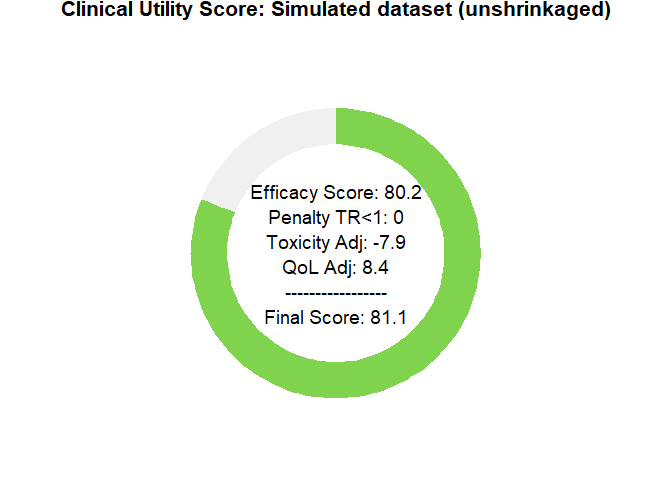
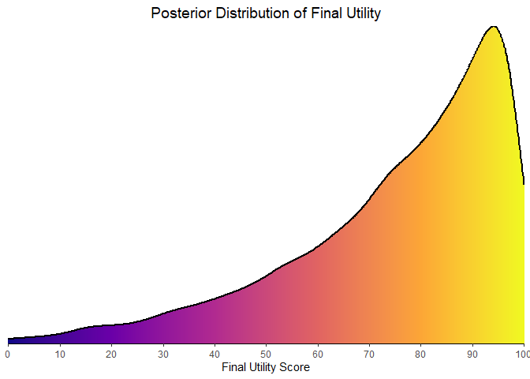

# bayescores: Comprehensive quantification of clinical benefit in randomized controlled trials using Bayesian AFT cure models

**`bayescores`** provides a comprehensive toolkit for analyzing
randomized controlled trials (RCTs). This package introduces the
**Bayesian Clinical Benefit Scores (BayeScores)**, a novel metric to
quantify clinical benefit by accounting for both survival prolongation
and cure rates.

The package includes functions to:

- Simulate realistic survival data from a mixture cure model.
- Fit Bayesian Accelerated Failure Time (AFT) mixture cure models using
  Stan.
- Visualize model results and diagnostics.
- Calculate and visualize BayeScores to provide a holistic measure of
  clinical benefit.

## Installation

Install the development version of `bayescores` from GitHub:

``` r
# install.packages("devtools")
devtools::install_github("albertocarm/bayescores")
```

## Full example

This example illustrates the complete workflow—from data simulation to
visualization of benefit scores. Here, simulated RCTs enable clear
observation of how parameter changes influence BayeScores.

### Step 1: Load the package

``` r
library(bayescores)
```

### Step 2: Simulate survival data

Simulate a 600-patient trial with long-term survival fractions of 40%
(experimental) and 20% (control), with median survival of 12 months in
the control arm. The experimental treatment extends survival by 50%
among non-cured patients.

``` r
set.seed(123)

sim_data <- simulate_weibull_cure_data(
  n_patients = 600,
  cure_fraction_ctrl = 0.20,
  cure_fraction_exp = 0.30,
  max_follow_up = 60,
  weibull_shape = 1.2,
  median_survival_ctrl = 12,
  time_ratio_exp = 1.25
)

plot_km_curves(sim_data)
```

<!-- -->

``` r
data(package = "bayescores")
```

### Step 3: Simulate study toxicity

Generate toxicity data for a trial with 1:1 randomization (300 control
patients), baseline toxicity of 50% (any-grade), 20% severe events
(G3–4), and 1.5× higher toxicity in the experimental arm. QoL outcomes
assume “Significant Improvement” with “Very High” evidence.

**Quality of Life Parameters:**

- `qol_scenario` (expected QoL outcome):

- `1`: **Significant Improvement**

- `2`: **Stabilization / Probable Benefit**

- `3`: **No Difference / Marginal Benefit**

- `4`: **Deterioration**

- `5`: **Insufficient Data / Unknown**

- `qol_strength` (confidence in QoL evidence):

- `1`: **Very Low**

- `2`: **Low**

- `3`: **Moderate**

- `4`: **High**

- `5`: **Very High**

``` r
toxicity_trial <- simulate_trial_data(
n_control = 600,
ratio_str = "1:1",
control_g1_4_pct = 50,
control_g3_4_pct = 20,
tox_ratio = 1.5,
qol_scenario = 1,
qol_strength = 5
)
```

To analyze toxicity in *non-simulated data*, you obviously need to go to
the actual toxicity table, look up the quality-of-life articles
associated with that trial, and manually fill in an object similar to
the one produced by the simulate_trial_data function.

Visualize toxicity with AMIT plots:

**Any-grade toxicity (Grades 1–4)**

``` r
create_amit_plot(
trial_object = toxicity_trial,
grade_type = "any_grade",
main_title = "Example: Any-Grade Toxicity Profile",
data_element = "toxicity",
n_element = "N_patients"
)
```

<!-- -->

**Severe toxicity (Grades 3+)**

``` r
create_amit_plot(
trial_object = toxicity_trial,
grade_type = "severe_grade",
main_title = "Example: Severe-Grade (G3+) Toxicity Profile",
data_element = "toxicity",
n_element = "N_patients"
)
```

<!-- -->

### Step 4: Fit the Bayesian cure model

Fit the Bayesian AFT cure model (use higher `iter` in practice):

``` r
bayesian_fit <- fit_bayesian_cure_model(
sim_data,
time_col = "time",
event_col = "event",
arm_col = "arm",
iter = 2500,
chains = 4
)
```

    ## 
    ## SAMPLING FOR MODEL 'anon_model' NOW (CHAIN 1).
    ## Chain 1: 
    ## Chain 1: Gradient evaluation took 0.000376 seconds
    ## Chain 1: 1000 transitions using 10 leapfrog steps per transition would take 3.76 seconds.
    ## Chain 1: Adjust your expectations accordingly!
    ## Chain 1: 
    ## Chain 1: 
    ## Chain 1: Iteration:    1 / 2500 [  0%]  (Warmup)
    ## Chain 1: Iteration:  250 / 2500 [ 10%]  (Warmup)
    ## Chain 1: Iteration:  500 / 2500 [ 20%]  (Warmup)
    ## Chain 1: Iteration:  750 / 2500 [ 30%]  (Warmup)
    ## Chain 1: Iteration: 1000 / 2500 [ 40%]  (Warmup)
    ## Chain 1: Iteration: 1001 / 2500 [ 40%]  (Sampling)
    ## Chain 1: Iteration: 1250 / 2500 [ 50%]  (Sampling)
    ## Chain 1: Iteration: 1500 / 2500 [ 60%]  (Sampling)
    ## Chain 1: Iteration: 1750 / 2500 [ 70%]  (Sampling)
    ## Chain 1: Iteration: 2000 / 2500 [ 80%]  (Sampling)
    ## Chain 1: Iteration: 2250 / 2500 [ 90%]  (Sampling)
    ## Chain 1: Iteration: 2500 / 2500 [100%]  (Sampling)
    ## Chain 1: 
    ## Chain 1:  Elapsed Time: 7.779 seconds (Warm-up)
    ## Chain 1:                11.936 seconds (Sampling)
    ## Chain 1:                19.715 seconds (Total)
    ## Chain 1: 
    ## 
    ## SAMPLING FOR MODEL 'anon_model' NOW (CHAIN 2).
    ## Chain 2: 
    ## Chain 2: Gradient evaluation took 0.000445 seconds
    ## Chain 2: 1000 transitions using 10 leapfrog steps per transition would take 4.45 seconds.
    ## Chain 2: Adjust your expectations accordingly!
    ## Chain 2: 
    ## Chain 2: 
    ## Chain 2: Iteration:    1 / 2500 [  0%]  (Warmup)
    ## Chain 2: Iteration:  250 / 2500 [ 10%]  (Warmup)
    ## Chain 2: Iteration:  500 / 2500 [ 20%]  (Warmup)
    ## Chain 2: Iteration:  750 / 2500 [ 30%]  (Warmup)
    ## Chain 2: Iteration: 1000 / 2500 [ 40%]  (Warmup)
    ## Chain 2: Iteration: 1001 / 2500 [ 40%]  (Sampling)
    ## Chain 2: Iteration: 1250 / 2500 [ 50%]  (Sampling)
    ## Chain 2: Iteration: 1500 / 2500 [ 60%]  (Sampling)
    ## Chain 2: Iteration: 1750 / 2500 [ 70%]  (Sampling)
    ## Chain 2: Iteration: 2000 / 2500 [ 80%]  (Sampling)
    ## Chain 2: Iteration: 2250 / 2500 [ 90%]  (Sampling)
    ## Chain 2: Iteration: 2500 / 2500 [100%]  (Sampling)
    ## Chain 2: 
    ## Chain 2:  Elapsed Time: 23.593 seconds (Warm-up)
    ## Chain 2:                24.911 seconds (Sampling)
    ## Chain 2:                48.504 seconds (Total)
    ## Chain 2: 
    ## 
    ## SAMPLING FOR MODEL 'anon_model' NOW (CHAIN 3).
    ## Chain 3: 
    ## Chain 3: Gradient evaluation took 0.000356 seconds
    ## Chain 3: 1000 transitions using 10 leapfrog steps per transition would take 3.56 seconds.
    ## Chain 3: Adjust your expectations accordingly!
    ## Chain 3: 
    ## Chain 3: 
    ## Chain 3: Iteration:    1 / 2500 [  0%]  (Warmup)
    ## Chain 3: Iteration:  250 / 2500 [ 10%]  (Warmup)
    ## Chain 3: Iteration:  500 / 2500 [ 20%]  (Warmup)
    ## Chain 3: Iteration:  750 / 2500 [ 30%]  (Warmup)
    ## Chain 3: Iteration: 1000 / 2500 [ 40%]  (Warmup)
    ## Chain 3: Iteration: 1001 / 2500 [ 40%]  (Sampling)
    ## Chain 3: Iteration: 1250 / 2500 [ 50%]  (Sampling)
    ## Chain 3: Iteration: 1500 / 2500 [ 60%]  (Sampling)
    ## Chain 3: Iteration: 1750 / 2500 [ 70%]  (Sampling)
    ## Chain 3: Iteration: 2000 / 2500 [ 80%]  (Sampling)
    ## Chain 3: Iteration: 2250 / 2500 [ 90%]  (Sampling)
    ## Chain 3: Iteration: 2500 / 2500 [100%]  (Sampling)
    ## Chain 3: 
    ## Chain 3:  Elapsed Time: 8.197 seconds (Warm-up)
    ## Chain 3:                13.795 seconds (Sampling)
    ## Chain 3:                21.992 seconds (Total)
    ## Chain 3: 
    ## 
    ## SAMPLING FOR MODEL 'anon_model' NOW (CHAIN 4).
    ## Chain 4: 
    ## Chain 4: Gradient evaluation took 0.000348 seconds
    ## Chain 4: 1000 transitions using 10 leapfrog steps per transition would take 3.48 seconds.
    ## Chain 4: Adjust your expectations accordingly!
    ## Chain 4: 
    ## Chain 4: 
    ## Chain 4: Iteration:    1 / 2500 [  0%]  (Warmup)
    ## Chain 4: Iteration:  250 / 2500 [ 10%]  (Warmup)
    ## Chain 4: Iteration:  500 / 2500 [ 20%]  (Warmup)
    ## Chain 4: Iteration:  750 / 2500 [ 30%]  (Warmup)
    ## Chain 4: Iteration: 1000 / 2500 [ 40%]  (Warmup)
    ## Chain 4: Iteration: 1001 / 2500 [ 40%]  (Sampling)
    ## Chain 4: Iteration: 1250 / 2500 [ 50%]  (Sampling)
    ## Chain 4: Iteration: 1500 / 2500 [ 60%]  (Sampling)
    ## Chain 4: Iteration: 1750 / 2500 [ 70%]  (Sampling)
    ## Chain 4: Iteration: 2000 / 2500 [ 80%]  (Sampling)
    ## Chain 4: Iteration: 2250 / 2500 [ 90%]  (Sampling)
    ## Chain 4: Iteration: 2500 / 2500 [100%]  (Sampling)
    ## Chain 4: 
    ## Chain 4:  Elapsed Time: 8.029 seconds (Warm-up)
    ## Chain 4:                39.511 seconds (Sampling)
    ## Chain 4:                47.54 seconds (Total)
    ## Chain 4:

### Step 5: Analyze and visualize model results

The mixture cure model separates individuals into:

- **Cured (long-term survivors)**: negligible event risk long-term.
- **Susceptible (uncured)**: ongoing event risk; survival prolonged but
  not cured.

Inspect numerical summaries and visualize posterior distributions. You
can verify that the model satisfactorily recovers the time ratio and the
fractions of long‑term survivors:

``` r
print(bayesian_fit$stan_fit, pars = c("beta_cure_arm", "beta_surv_arm", "alpha"))
```

    ## Inference for Stan model: anon_model.
    ## 4 chains, each with iter=2500; warmup=1000; thin=1; 
    ## post-warmup draws per chain=1500, total post-warmup draws=6000.
    ## 
    ##               mean se_mean   sd  2.5%  25%  50%  75% 97.5% n_eff Rhat
    ## beta_cure_arm 0.24       0 0.19 -0.14 0.11 0.24 0.36  0.60  3129    1
    ## beta_surv_arm 0.11       0 0.09 -0.06 0.05 0.11 0.17  0.28  2637    1
    ## alpha         1.26       0 0.06  1.16 1.22 1.26 1.30  1.37  3785    1
    ## 
    ## Samples were drawn using NUTS(diag_e) at Fri Aug  1 00:32:18 2025.
    ## For each parameter, n_eff is a crude measure of effective sample size,
    ## and Rhat is the potential scale reduction factor on split chains (at 
    ## convergence, Rhat=1).

``` r
outcomes(bayesian_fit)
```

    ## # A tibble: 5 × 2
    ##   Metric                                     `Result (95% CI)`    
    ##   <chr>                                      <chr>                
    ## 1 Time Ratio (TR)                            1.12 (0.94 - 1.33)   
    ## 2 Odds Ratio (OR) for Cure                   1.27 (0.87 - 1.82)   
    ## 3 Long-Term Survival Rate (%) - Control      24.07 (19.43 - 29.45)
    ## 4 Long-Term Survival Rate (%) - Experimental 28.67 (23.65 - 34.08)
    ## 5 Absolute Difference in Survival Rate (%)   4.61 (-2.78 - 11.51)

## ⚠️ A Note on Model Identifiability

Users should be aware of an inherent characteristic of **mixture cure
models**, especially when working with clinical trials that have smaller
sample sizes (*low n*).

These models explain a survival benefit by attributing it to two main
components:

- An increase in the **cure fraction** (long-term survivors), and  
- An improvement in the **Time Ratio** (survival among non-cured
  patients).

With limited data, it can be difficult for the model to fully
distinguish between these two effects.  
This can lead to a kind of *trade-off*, where the model might compensate
a weakly identified cure effect by **overestimating the Time Ratio**, or
vice versa.

As a result, you may sometimes see “weird” or unintuitive combinations —
for example, a very strong TR and almost no difference in cure, or the
opposite.

**Therefore, it is crucial to inspect both parameters and their credible
intervals** to properly interpret the overall treatment effect.

Don’t rely on a single number. Read the model like a clinician:  
look at the whole picture.

**Posterior distributions**

``` r
plot_densities(bayesian_fit)
```

<figure>

<figcaption aria-hidden="true">Figure 1: Posterior density distributions
for Time Ratio, Odds Ratio of Cure, and Cure Probability
Difference.</figcaption>
</figure>

**Posterior predictive check** You can observe how the model’s
predictions align satisfactorily with the Kaplan–Meier estimator:

``` r
plot(bayesian_fit)
```

<figure>

<figcaption aria-hidden="true">Figure 2: Posterior predictive check
(model vs Kaplan-Meier data).</figcaption>
</figure>

### Step 6: Integrate toxicity data

Toxicity is summarized by a burden‑of‑toxicity score, which weights both
the severity and the category of toxicity (see technical documentation).

Estimates below zero, as observed here, indicate greater toxicity in the
experimental arm, consistent with the simulation:

``` r
set.seed(123)
toxicity_output <- calculate_toxicity_analysis(
trial_data = toxicity_trial,
n_simulations = bayesian_fit$n_draws,
 unacceptable_rel_increase = 0.5,
k_uncertainty = 5
)
```

# Understanding the Toxicity Analysis in Practice

The toxicity analysis provides a nuanced view of a drug’s safety
profile. Let’s break down the key parameters using a practical example
where the function returns these scores:

``` r
toxicity_output$wts_scores
```

    ##   Experimental Control
    ## 1        3.009  1.9695

**1. What are the WTS (Weighted Toxicity Scores)?**

Think of the WTS as a *total harm score* for each arm of the trial. It’s
not just a simple count of side effects. Instead, it’s a composite score
where:

- *Severity matters*: High-grade toxicities (Grade 3-4) add much more to
  the score than low-grade ones.
- *Type matters*: Clinically relevant toxicities (e.g., blood disorders)
  are weighted more heavily than less critical ones (e.g., skin
  disorders).

In our example, let’s say the experimental arm ended up with a harm
score of 2.7495, versus 1.877 for control. (Truth be told, these numbers
dance around a little — it’s a simulation — but you get the idea.) What
matters is the pattern: the experimental drug is clearly more toxic. The
real question is: how much more is too much?

------------------------------------------------------------------------

**2. Defining “Unacceptable” (`unacceptable_rel_increase = 0.5`)**

This parameter is your *toxicity budget*. It doesn’t set a fixed limit,
but a relative one based on the control arm.  
A value of `0.5` means:

> “I am willing to accept a new drug that is up to 50% more toxic than
> the control. Anything beyond that, I consider unacceptable.”

Let’s apply this to our scores:

- **Your Budget** (in WTS points): `1.877 * 0.5 = 0.9385`
- **The Observed Cost**: `2.7495 - 0.9385 = 1.811`

**Conclusion**: The observed increase in harm (**1.811**) is greater
than your budget (**0.9385**).  
Therefore, according to your own definition, the toxicity of the new
drug is *unacceptable*.

This comparison is used to center the final probability distribution.

------------------------------------------------------------------------

**3. Calibrating Uncertainty (`k_uncertainty`)**

The real world has uncertainty. The `k_uncertainty` parameter lets you
define how skeptical you are of the results, which influences the
*confidence* of the final output. It directly controls the width of the
final probability distribution.

- A low `k` (e.g., 5) means you have high confidence in the data. You
  believe the observed difference is close to the true difference. This
  results in a narrow, sharp probability distribution, leading to a more
  decisive conclusion.
- A high `k` (e.g., 30) means you are more skeptical. You believe the
  observed difference could be due to random chance, especially with a
  small number of patients. This results in a wide, flat probability
  distribution, indicating less certainty in the outcome.

In short, `k_uncertainty` allows you to calibrate the model based on the
quality and size of the trial data, ensuring the final result reflects
an appropriate level of statistical confidence.

### Step 7: Quality-of-life weighting

QoL adjustments modeled using multinomial distribution:

``` r
qol_scores <- sample_qol_scores(
prob_vector = toxicity_trial$qol,
n_samples = bayesian_fit$n_draws
)

plot_qol_histogram(qol_scores)
```

<figure>

<figcaption aria-hidden="true">Figure 4: Multinomial distribution of QoL
levels.</figcaption>
</figure>

We have chosen this methodology because quality‑of‑life data are
published very inconsistently—indeed, the data are a mess—and the
approach will likely evolve over time. Therefore, you must read the
paper, qualitatively interpret the results, and assess both the impact
on quality of life and the strength of evidence. The outcome will be a
multinomial distribution, as shown below. It is quite straightforward:
to work with real data, the package includes the function
generate_qol_vector(), which interactively generates a quality‑of‑life
(QoL) probability vector.

### Step 8: Extract posterior samples and compute BayeScores

# From Clinical Data to a Final Score

Okay, we have the results from our Bayesian model:  
estimates for efficacy, toxicity, and QoL.  
But how do we turn these numbers into a single, intuitive **BayeScore**?

This is where the *calibration* comes in.

------------------------------------------------------------------------

Instead of using fixed rules, our model translates each clinical outcome
into a  
**utility score** (from 0 to 100) using a flexible exponential utility
function.

Think of it this way:  
the *first* improvements are the most exciting.  
Going from no benefit to *some* benefit is a huge leap.  
Further gains are still good, but the “wow factor” diminishes slightly.

Our function captures this key principle of **diminishing marginal
utility**.

------------------------------------------------------------------------

The best part is: *you define the value judgment*.  
The shape of these utility curves is determined by setting simple
**anchor points**.  
You answer the question:

> “How much is a certain clinical benefit worth on a 0–100 scale?”

For example, in our analysis, we used the following calibration:

``` r
efficacy_inputs <- list(
  tr_posterior_samples = extract_mcmc_time_ratios(bayesian_fit),
  cure_posterior_samples = extract_mcmc_cure_diffs(bayesian_fit)
)


# 1. Define the Final Calibration Settings ---
my_final_calibration <- list(
  efficacy = list(
    # Aggressive curve for Cure
    cure_utility_target = list(effect_value = 0.20, utility_value = 75),
    
    # Slower curve for TR
    tr_utility_target = list(effect_value = 1.25, utility_value = 50)
  )
)


# 2. Run the Bayescores Function on Your Data ---
# The function takes your data objects directly as inputs.
final_utilities <- get_bayescores(
  efficacy_inputs = efficacy_inputs,
  qol_scores = qol_scores,
  toxicity_scores = toxicity_output$toxicity_effect_vector,
  calibration_args = my_final_calibration
)
cat("--- Final Bayescores Summary ---\n")
```

    ## --- Final Bayescores Summary ---

``` r
print(final_utilities$component_summary)
```

    ##                                                     Component    Median
    ## Utility TR (0-100)                         Utility TR (0-100)  27.67119
    ## Utility Cure (0-100)                     Utility Cure (0-100)  27.37536
    ## Efficacy Score (Combined)           Efficacy Score (Combined)  47.99946
    ## QoL Contribution (points)           QoL Contribution (points)  12.12045
    ## Toxicity Contribution (points) Toxicity Contribution (points) -20.62685
    ## FINAL UTILITY SCORE                       FINAL UTILITY SCORE  35.95623
    ##                                Lower_95_CrI.2.5% Upper_95_CrI.97.5%
    ## Utility TR (0-100)                     0.0000000          59.568890
    ## Utility Cure (0-100)                   0.0000000          54.958276
    ## Efficacy Score (Combined)              9.3418622          74.593677
    ## QoL Contribution (points)            -23.9467155          24.981138
    ## Toxicity Contribution (points)       -24.9763717          -5.158959
    ## FINAL UTILITY SCORE                    0.9792256          82.235288

### Step 9: Visualize final clinical benefit

**BayeScore donut plot**

After these analyses, the tool delivers a final *clinical utility score*
derived from all the weightings, representing the drug’s ultimate
evaluation. This score is based on a simulation that assumed benefit but
also factored in some toxicity, yet still resulted in an improvement in
quality of life.

``` r
plot_utility_donut(final_utilities)
```

    ## Enter the trial name for the plot title:

<figure>

<figcaption aria-hidden="true">Figure 5: BayeScore donut
plot.</figcaption>
</figure>

**Final score posterior distribution**

It’s clear that estimating clinical benefit carries substantial
uncertainty—studies are noisy, and sample sizes are limited. We’ve
rigorously propagated every source of uncertainty throughout the
analysis, so that you alone judge the credibility of the results.

That is the power of the BayeScore: it isn’t a single point estimate but
a full Bayesian distribution!

``` r
plot_final_utility_density(final_utilities)
```

<figure>

<figcaption aria-hidden="true">Figure 6: Final BayeScore posterior
distribution.</figcaption>
</figure>

**Sensitivity Analysis Dashboard** To help understand the overall effect
of parameter selection on the final Bayescore and to assist in model
calibration, we have developed a comprehensive sensitivity analysis
dashboard.

This function generates an 8-panel plot that visualizes how the final
utility score responds to changes in the core model parameters, such as
Time Ratio (TR), Cure Rate, Quality of Life (QoL), and Toxicity. It
provides a global view of the model’s behavior under different
conditions.

``` r
# First, we define any custom calibration arguments.
# We can use an empty list to accept the model's defaults.
calibration_settings <- list(
  efficacy = list(
    cure_utility_target = list(effect_value = 0.20, utility_value = 75),
    tr_utility_target = list(effect_value = 1.25, utility_value = 50)
  )
)


# Now, we generate the complete 8-panel dashboard
# The function will print its progress as it generates the data.
dashboard <- generate_sensitivity_dashboard(
  calibration_args = calibration_settings
)
```

    ## Generating data for all 8 plots...
    ##  Data generation complete.

``` r
# Finally, display the plot
print(dashboard)
```

<!-- -->

**Digitizing Kaplan-Meier Curves to Obtain IPD**

To facilitate evidence synthesis, we have created a high-level function,
km_to_dataset, to extract Individual Patient Data (IPD) directly from
images of Kaplan-Meier plots. This tool is essentially a wrapper that
implements the well-established Guyot et al. method by leveraging the
functionalities of two powerful packages: SurvdigitizeR and survHE.

Image Preparation Before using the function, the plot image requires a
simple manual pre-processing step. First, copy the plot from the source
publication. Then, using a basic image editor like Paint, erase all
extraneous elements such as titles, legends, and any other annotations.
The final image should contain only the survival curves, the X and Y
axes, and the numbers on those axes.

For our example, we use *Figure 1* from the CheckMate 649 trial
publication (DOI: 10.1200/JCO.23.01601).

*Example: Reconstructing Data from CheckMate 649* The following code
demonstrates the complete workflow. First, we define the necessary
parameters. The most important ones are:

time_intervals: This is the vector of time points at which the number of
patients at risk is reported in the publication’s plot.

nrisk_data_list: This is a named list where each element contains the
number-at-risk data corresponding to a treatment arm, as transcribed
from the plot.

``` r
# --- 1. Define all parameters for the main function ---

# NOTE: Provide the full path to your cleaned image file.
image_file_path  <- "C:/path/to/your/cleaned_plot_image.png"

# Time points for the number-at-risk table (from the plot's x-axis)
time_intervals   <- seq(0, 63, 3)

# The output file where the final IPD data frame will be saved
output_file_name <- "final_ipd_data.Rda"

# Number-at-risk data, transcribed from the publication's plot
nrisk_data_list <- list(
  control = c(482, 424, 353, 275, 215, 154, 125, 97, 83, 69, 60, 51, 44, 35, 28, 18, 14, 10, 5, 0, 0),
  experimental = c(473, 440, 380, 315, 263, 223, 187, 161, 141, 118, 105, 100, 94, 81, 66, 53, 37, 24, 17, 6, 2)
)

# --- 2. Run the entire workflow ---
final_dataset <- km_to_dataset(
  img_path = image_file_path,
  time_breaks = time_intervals,
  n_risk_list = nrisk_data_list,
  output_filename = output_file_name,
  # Axis calibration parameters (from the plot)
  x_start = 0, x_end = 63, x_increment = 3,
  y_start = 0, y_end = 1, y_increment = 0.1
)

# --- 3. Verify the result by re-plotting the reconstructed data ---
fit <- survival::survfit(survival::Surv(time, event) ~ arm, data = final_dataset)

print(
  survminer::ggsurvplot(
    fit, data = final_dataset, conf.int = FALSE, risk.table = TRUE,
    break.time.by = 3, risk.table.height = 0.25, risk.table.y.text.col = TRUE,
    risk.table.y.text = FALSE, legend.title = "Arm",
    legend.labs = names(nrisk_data_list)
  )
)
```

And voilà! Ready to estimate the clinical benefit of new drugs!

## Why bayescores? a more meaningful approach

- **Clinically interpretable**: time ratios are more intuitive than
  hazard ratios; cure models resolve the issue of double counting
  benefit—first in HR terms and again as the long‑term bonus. this
  ensures both metrics remain independent.  
- **Accounts for cure scenarios**: explicit modeling of cure rates and
  long‑term survivor fractions in immunotherapy studies.  
- **Embraces uncertainty**: the Bayesian framework transparently conveys
  uncertainty.  
- **No thresholds**: there are parameters and weights, but the approach
  is gradual; it avoids all‑or‑nothing decisions and is transparent and
  customizable.

## Citation

``` r
citation("bayescores")
```
